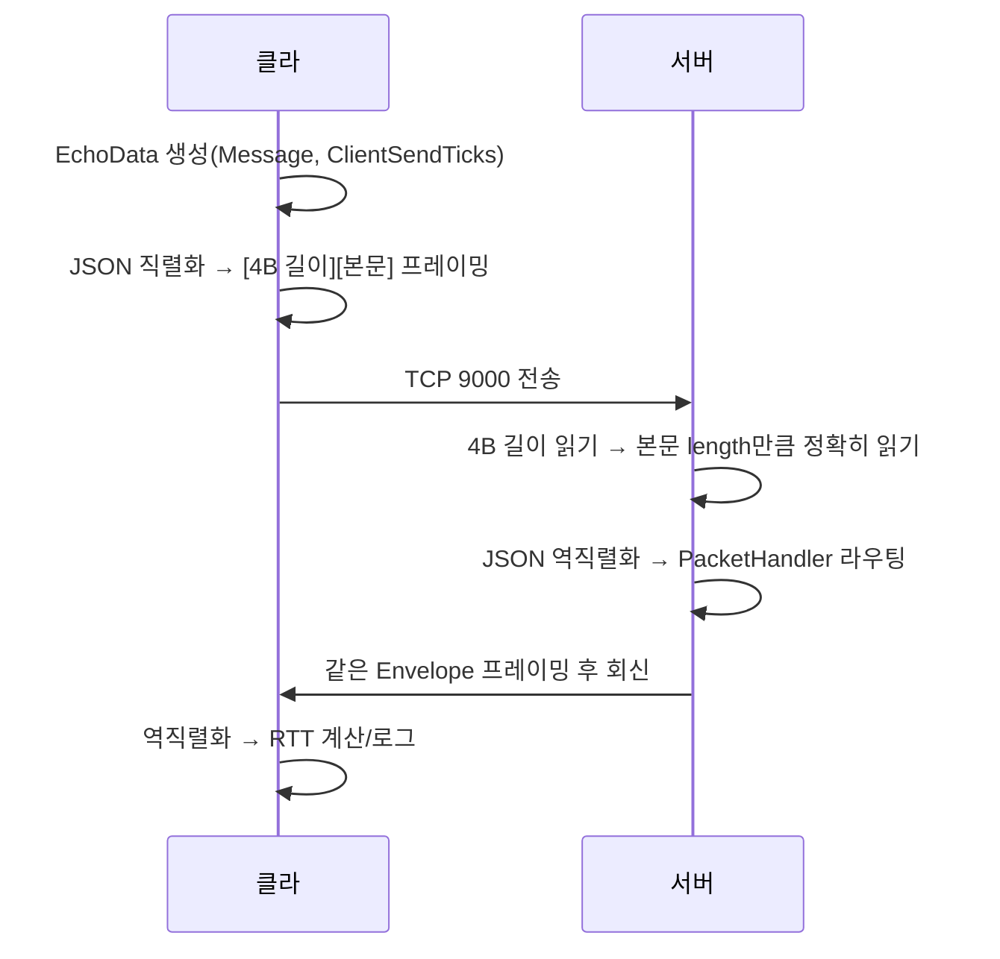
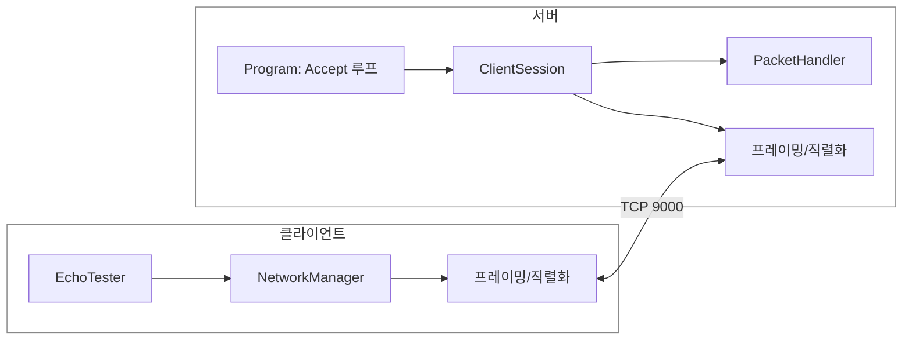

# 1단계 — TCP 소켓 통신 기초 (에코 서버)

> Unity(클라) ↔ C# 콘솔 서버(.NET 8) 구조의 1단계.
> 이 단계의 목표는 "에코"가 아니라 **TCP는 메시지가 아니라 바이트 스트림이다**라는 사실 하나를 코드와 실험으로 체득하는 것.
> ([← 전체 로드맵으로 돌아가기](../README.md))

---

## 1. 이 단계에서 만든 것

클라이언트에서 입력한 문자열을 서버로 보내면, 서버가 그대로 돌려주는 에코(echo) 통신. 단순해 보이지만 그 안에 **패킷 프레이밍, JSON 직렬화, 패킷 라우팅, 스레드 분리, 입력 검증**이 모두 들어있다.

```
[입력] → JSON 직렬화 → [4B 길이][본문] 프레이밍 → TCP 전송
       → 서버: 길이 읽기 → 본문 정확히 읽기 → 역직렬화 → 라우팅 → 회신
       → 클라: 수신 → RTT 측정 → 로그 출력
```

---

## 2. 아키텍처

### 폴더 구조

**클라이언트 (Unity)**
```
Assets/Code/Scripts/Net/
├── Envelope.cs          ← 공통 프로토콜 (서버와 동일)
├── EchoData.cs          ← 공통 프로토콜 (서버와 동일)
├── NetworkManager.cs    ← 연결·송수신·프레이밍·스레드 관리
└── EchoTester.cs        ← 테스트용 UI 및 RTT 측정
```

**서버 (C# 콘솔, Unity Assets 바깥)**
```
DedicatedServer/
├── Program.cs           ← 진입점, Accept 루프
├── Protocol/
│   ├── Envelope.cs
│   └── EchoData.cs
└── Net/
    ├── PacketFraming.cs ← [4B 길이][본문] 읽고 쓰기
    ├── ClientSession.cs ← 연결 1개 = 세션 1개
    └── PacketHandler.cs ← Type별 패킷 라우팅
```

> 서버는 Unity의 `Assets/` 바깥에 둔다. `Assets/` 안의 `.cs`는 Unity가 자동으로 컴파일하려 들기 때문에, .NET 콘솔 서버 코드가 들어가면 충돌한다. 서버는 `dotnet`이 빌드해야 한다.

### 통신 흐름


### 컴포넌트 구조


---

## 3. 핵심 설계 판단과 트레이드오프

### 왜 TCP인가 (TCP vs UDP)
| | TCP | UDP |
|---|---|---|
| 전달 보장 | 순서 보장 + 재전송 | 보장 없음 |
| 메시지 경계 | **없음 (바이트 스트림)** | 있음 (데이터그램 단위) |
| 적합 | 로그인·채팅·인벤토리 (반드시 도착) | 위치 동기화 (최신값 중요, 일부 유실 허용) |

학습용이라 전부 TCP로 진행. 실무 FPS는 위치를 UDP로 보내지만, 그건 "왜 TCP로 매 프레임 좌표를 쏘면 안 되는가"를 직접 겪은 뒤에야 의미가 생긴다. (5단계에서 다룸)

### 왜 길이 프리픽스 프레이밍인가 (이 단계의 핵심)
TCP `Read()`는 "내가 보낸 한 통"을 그대로 돌려주지 않는다. OS가 버퍼에 모인 바이트를 임의 크기로 잘라 준다. 그래서 두 가지 사고가 난다.
- **합쳐짐(sticky):** 두 번 보낸 메시지가 한 번에 붙어서 옴
- **쪼개짐:** 한 메시지가 여러 번에 나뉘어 옴

해결책은 본문 앞에 "이 메시지는 N바이트"를 4바이트로 붙이는 것. 받는 쪽은 ①4바이트를 읽어 N을 알아내고 → ②**정확히 N바이트를 채울 때까지 반복해서** 읽는다. 이 "정확히 N바이트 채우기 루프"가 1단계에서 가장 중요한 코드다.

### 왜 JSON(Newtonsoft)인가
사람이 읽기 쉽고 디버깅이 쉬워 학습·프로토타이핑에 최적. 단점은 용량이 크고 파싱이 느린 것. 실무에서 위치를 초당 수십 번 보낼 땐 바이트 직렬화(Protobuf 등)로 바꾼다. 이 프로젝트는 끝까지 JSON으로 가되, "왜 부하가 되는가"는 5단계에서 체감.

### 실무에선 어떻게 다른가
직접 짠 TCP + 프레이밍 + 동기화는 실무에선 보통 **Mirror / Photon / Netcode for GameObjects / FishNet** 같은 솔루션으로 대체된다. 직접 구현하는 이유는 "그 안에서 무슨 일이 일어나는지" 이해하기 위함 — 학습용임을 명확히 한다.

---

## 4. 트러블슈팅 / 러닝 로그

> 1단계를 진행하며 실제로 막혔던 지점과 해결 과정. 각 항목은 **① 문제 / 이유 · ② 증상 · ③ 해결 방법 · ④ 짚고 갈 점** 순서로 정리.

### (1) `.bat` 실행 시 한글 콘솔 로그가 깨짐
- **① 문제 / 이유:** Windows 콘솔의 기본 코드페이지(CP949)와 파일 인코딩(UTF-8)이 달라서 한글이 깨졌다.
- **② 증상:** `.bat`으로 서버를 띄우니 한글 로그가 `?쒕쾭`처럼 깨져 나옴. 영어는 멀쩡 → 인코딩 문제로 추정.
- **③ 해결 방법:** `.bat`에 `chcp 65001 > nul`(UTF-8 코드페이지) 추가 + 파일을 UTF-8로 저장. C#은 `Program.cs` 최상단에 `Console.OutputEncoding = System.Text.Encoding.UTF8;` 추가.
- **④ 짚고 갈 점:** 깨짐은 "보내는 쪽(C#)"과 "표시하는 쪽(콘솔)" 양쪽 인코딩이 어긋나서 발생. 한쪽만 고치면 안 되고 **둘 다** UTF-8로 맞춰야 한다.

### (2) 프로젝트가 .NET 6 → .NET 8 전환 필요
- **① 문제 / 이유:** `ReadExactlyAsync`(정확히 N바이트 읽기)는 .NET 7+ 내장 함수인데, 기존 4월 프로젝트가 `net6.0`이라 못 썼다. (LTS는 짝수 8·10, STS는 홀수 9·11)
- **② 증상:** 최신 API가 컴파일되지 않음.
- **③ 해결 방법:** `.csproj`의 `<TargetFramework>net6.0</TargetFramework>`를 `net8.0`으로 직접 수정 후 `dotnet build`로 확인.
- **④ 짚고 갈 점:** 최신(11)보다 LTS(8)를 택한 것은 안정성·자료·라이브러리 호환·면접 설명력 모두에서 학습에 유리하기 때문. "최신을 안 쓴 것도 설계 판단"이다.

### (3) Visual Studio 2022 속성창에서 NullReferenceException
- **① 문제 / 이유:** IDE 버전이 새 프레임워크를 GUI로 다룰 만큼 최신이 아니면 속성 페이지 분석에서 실패할 수 있다.
- **② 증상:** 프로젝트 속성창을 열 때마다 `EntryPointFinder...NullReferenceException` 발생. 대상 프레임워크 드롭다운이 비어버림.
- **③ 해결 방법:** GUI 속성창 대신 `.csproj`를 직접 텍스트 편집. 빌드 확인은 CMD `dotnet build`로. (서버를 `.bat`/CMD로 실행하므로 VS GUI 자체가 필수가 아님)
- **④ 짚고 갈 점:** 이 예외는 **빌드가 아니라 VS 속성창 UI 한정 버그**였다. `.csproj`는 정상이었고 `dotnet build`도 성공 → 실제 개발엔 지장 없음. **도구의 문제와 코드의 문제를 분리해서 판단**한 것이 핵심.

### (4) [고장실험 1] 길이 헤더 없이 전송 → 서버가 길이를 2GB로 오해
- **① 문제 / 이유:** 헤더가 없으면 서버는 어디서 메시지를 끊어 읽을지 알 수 없다.
- **② 증상:** 길이 헤더 없이 본문(25바이트)만 두 번 보냈더니, 서버가 `비정상 패킷 길이: 2035556987`(약 2GB) 예외를 내고 세션 종료. 본문 첫 4바이트(`{"Ty`)를 길이로 오해한 것.
- **③ 해결 방법:** 정상 송신은 항상 `[4B 길이][본문]` 프레이밍을 붙이고, 서버는 길이를 먼저 읽어 그만큼만 정확히 읽는다. 추가로 길이 검증(`length <= 0 || length > MaxPacketSize`)을 둔다.
- **④ 짚고 갈 점:** TCP는 Read 한 번에 메시지 하나를 보장하지 않으므로 경계는 길이 헤더로만 정의 가능. 길이 검증이 없었다면 서버가 `new byte[2GB]`를 할당하려다 죽었을 것 — **클라가 보낸 값을 그냥 믿으면 안 된다(서버 권위·입력 검증)**는 사고방식의 첫 사례.

### (5) [고장실험 2] 서버를 끈 직후 전송 시 SocketException
- **① 문제 / 이유:** `TcpClient.Connected`는 "마지막 통신 시점 기준"의 낡은 정보라, 상대가 방금 끊은 것을 즉시 반영하지 못한다.
- **② 증상:** 서버를 `Ctrl+C`로 끈 직후 Send를 누르니 `IsConnected` 체크를 통과한 뒤 `Write`에서 `SocketException` 발생. 그 다음 Send부터는 `[Net] 미연결 상태` 경고만 반복.
- **③ 해결 방법:** `Send`를 try-catch로 감싸 예외 대신 경고 로그로 처리하고 연결 정리. (완전한 자동 재연결은 추가 단계에서 구현)
- **④ 짚고 갈 점:** "보내기 직전엔 멀쩡해 보였는데 보내는 순간 터지는" 것은 네트워크 코드의 고전적 함정. `Connected` 플래그만 믿을 수 없으므로 실제 쓰기를 try-catch로 감싸는 **이중 방어**가 필요하다. 추가 단계의 자동 재연결이 왜 필요한지의 근거가 된다.

### (6) RTT 첫 패킷만 느림 (214ms → 11ms)
- **① 문제 / 이유:** 첫 호출에는 JIT 컴파일, 직렬화 워밍업, 연결 초기화 비용이 몰린다 (콜드 스타트).
- **② 증상:** 로컬(127.0.0.1)인데 첫 에코 RTT가 214ms로 높았다가, 두 번째부터 11ms로 떨어짐.
- **③ 해결 방법:** 별도 조치 불필요. 정상 현상임을 이해.
- **④ 짚고 갈 점:** 로컬 왕복이 200ms일 리 없으므로 "측정값이 이상하면 환경 요인을 의심"하는 게 맞다. 첫 패킷 비용은 실무의 콜드 스타트 개념의 축소판.

---

## 5. 패킷 프로토콜 정의

| Type | 방향 | Data 필드 | 설명 |
|---|---|---|---|
| Echo | C→S, S→C | Message(string), ClientSendTicks(long) | 보낸 문자열 그대로 회신. ClientSendTicks로 RTT 측정 |

> 패킷 종류가 늘어나면 이 표로 관리해 클라/서버 정의가 어긋나지 않게 한다.

---

## 6. 현재 코드의 알려진 한계 (의도적으로 남겨둠)

1단계 범위(TCP·프레이밍)에 집중하기 위해 아래는 인지만 하고 추가 단계로 미룸.

- **클라 동기 연결:** `_client.Connect()`가 동기라 연결이 느리면 멈춘다. 실무는 비동기 + 타임아웃.
- **자동 재연결 없음:** 끊기면 영영 안 붙는다. 추가 단계에서 재연결 루프 구현.
- **프로토콜 코드 중복:** `Envelope`/`EchoData`가 서버·클라에 복붙되어 있다. 한쪽만 고치면 통신이 깨진다. 추후 공유 라이브러리로 분리 검토.
- **바이트 오더:** `BitConverter`가 OS 엔디언을 따른다. 양쪽 다 Windows라 문제없지만, 엄밀한 프로토콜이라면 네트워크 바이트 오더로 고정해야 한다.

---

## 7. 동작 확인 체크리스트

- [x] 서버 CMD에 "서버 시작" + "접속" 로그가 뜬다
- [x] Send 시 클라 Console에 `[에코 응답] ... (RTT ≈ Nms)`가 뜬다
- [x] 서버를 끄면 클라가 끊김을 감지해 로그를 남긴다
- [x] 모르는 Type을 보내도 서버가 안 죽고 "모르는 패킷 무시" 로그만 남긴다
- [x] 비정상 길이를 보내면 서버가 예외 로그만 남기고 세션만 종료한다 (서버 전체는 생존)

---

## 8. 이해 점검 질문

<details>
<summary><b>Q1. TCP는 메시지 경계를 보장하지 않는데 4바이트 길이 헤더가 이를 어떻게 해결하나? 받는 쪽에서 Read를 한 번만 호출하면 왜 안 되나?</b></summary>

> 길이 헤더는 "이 메시지가 몇 바이트인지"를 본문보다 먼저 알려준다. 받는 쪽은 먼저 4바이트를 읽어 N을 알아낸 뒤, **정확히 N바이트가 모일 때까지 반복해서** 읽으면 메시지 하나를 정확히 잘라낼 수 있다. `Read`를 한 번만 호출하면 안 되는 이유는, TCP는 바이트 스트림이라 OS가 데이터를 임의 크기로 쪼개거나 합쳐서 주기 때문이다. 한 번의 `Read`가 메시지의 일부만 주거나(쪼개짐), 여러 메시지를 한꺼번에 줄 수도 있다(합쳐짐). 따라서 "Read 1회 = 메시지 1개"라는 가정은 거짓이다.
</details>

<details>
<summary><b>Q2. 서버가 length를 검증 없이 new byte[length] 하면 어떤 사고가 가능한가?</b></summary>

> 고장실험 1에서 본 것처럼, 잘못된/악의적 데이터의 첫 4바이트가 터무니없는 값(예: 약 2GB)으로 해석될 수 있다. 이를 검증 없이 `new byte[length]`로 할당하면 서버가 거대한 메모리를 잡으려다 OutOfMemory로 죽거나 멈춘다. 악의적 클라가 일부러 이런 패킷을 보내면 서버 전체를 마비시키는 공격(DoS)이 된다. 그래서 `length <= 0 || length > MaxPacketSize` 같은 상한 검증으로 클라가 보낸 길이값을 먼저 거른다. 이것이 "클라가 보낸 값을 믿지 않는다"는 서버 권위의 첫 사례다.
</details>

<details>
<summary><b>Q3. Unity에서 수신 패킷을 읽기 스레드에서 곧장 GameObject에 적용하면 왜 위험한가? ConcurrentQueue → Update 패턴이 푸는 문제는?</b></summary>

> Unity의 API(Transform, GameObject 등)는 **메인 스레드에서만** 호출할 수 있다. 네트워크 수신은 별도 백그라운드 스레드(`ReadLoop`)에서 도는데, 거기서 곧장 GameObject를 건드리면 크래시가 나거나 조용히 깨진다. `ConcurrentQueue`는 백그라운드 스레드가 받은 패킷을 스레드 안전하게 쌓아두는 통로 역할을 하고, `Update()`(메인 스레드)에서 그 큐를 꺼내 처리하면 Unity API를 안전하게 호출할 수 있다. 즉 "수신은 백그라운드, 적용은 메인"으로 스레드 경계를 분리하는 패턴이다.
</details>

---

## 9. "처음부터 다시 만든다면?" 회고

<details>
<summary><b>Envelope.Data를 JSON 문자열로 이중 직렬화한 구조의 장단점은? switch 없이 더 깔끔히 라우팅하려면?</b></summary>

> **장점:** 서버가 Type만 먼저 보고 라우팅한 뒤, 해당 핸들러에서 Data를 그 타입으로 역직렬화하면 되어 구조가 단순하다. 패킷 종류가 늘어도 라우팅 코드가 일관적이다.
> **단점:** JSON 안에 JSON 문자열이 들어가는 이중 직렬화라 약간 비효율적이고, Data가 문자열이라 컴파일 타임 타입 안정성이 없다.
> **개선:** `switch`로 Type을 분기하는 대신, `Dictionary<string, IPacketHandler>` 같은 등록 테이블을 두면 새 패킷 추가 시 핸들러만 등록하면 되어 분기문이 늘지 않는다. (확장에 열려있고 수정에 닫힌 구조)
</details>

<details>
<summary><b>프로토콜 정의(Envelope/EchoData)를 양쪽에 복붙한 것이 맞았나? 공유 프로젝트로 빼면?</b></summary>

> **복붙의 문제:** 한쪽만 고치고 다른 쪽을 안 고치면 통신이 조용히 깨진다. 패킷이 늘수록 위험이 커진다.
> **공유 프로젝트(예: 별도 .NET 라이브러리)로 빼면:** 프로토콜 정의가 한 곳에만 존재해 불일치가 원천 차단된다. 다만 Unity와 .NET 콘솔이 같은 라이브러리를 참조하도록 빌드 구성을 맞춰야 해서 초기 설정이 번거롭다. 학습 단계에선 복붙이 단순해서 택했지만, 규모가 커지면 공유 라이브러리가 정답에 가깝다.
</details>
