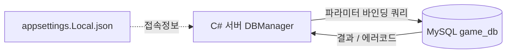

# 2단계 — MySQL DB 연결 (계정 저장·조회)

> C# 콘솔 서버(.NET 8)에 MySQL을 붙여, 데이터를 **영구히 저장하고 다시 꺼내는** 단계.
> 1단계가 통신(가로축, 클라 ↔ 서버)이라면, 2단계는 저장(세로축, 서버 ↔ DB)이다.
> ([← 전체 로드맵으로 돌아가기](../README.md))

---

## 1. 이 단계에서 만든 것

C# 서버가 MySQL에 연결해 계정을 생성·조회한다. `accounts` 테이블을 설계하고, `DBManager`를 통해 파라미터 바인딩으로 안전하게 쿼리한다. DB 접속정보는 코드/깃에서 분리한다.

```
[서버 시작] → appsettings.Local.json 읽기 → MySQL 연결 확인
            → CreateAccount(파라미터 바인딩 INSERT) → FindAccount(SELECT)
            → 중복(1062)·연결 실패 등 비정상 상황 처리
```

---

## 2. 아키텍처

### 폴더 구조

**서버 (C# 콘솔)**
```
DedicatedServer/
├── Program.cs                ← DB 설정 읽기 + 연결 테스트 (임시), 이후 TCP 리스너
├── DbConfig.cs               ← 접속정보 객체 + 접속 문자열 조립
├── Net/
│   └── DBManager.cs          ← 연결·INSERT·SELECT, 파라미터 바인딩, 예외 처리
├── appsettings.Local.json    ← 실제 접속정보 (gitignore, 커밋 금지)
└── appsettings.Example.json  ← 빈 템플릿 (커밋함)
```

### 데이터 흐름


### accounts 테이블 스키마
| 컬럼 | 타입 | 제약 | 의미 |
|---|---|---|---|
| account_id | INT | PK, AUTO_INCREMENT | 계정 고유 번호 |
| username | VARCHAR(50) | NOT NULL, UNIQUE | 로그인 아이디 (중복 불가) |
| password_hash | VARCHAR(255) | NOT NULL | 해싱된 비밀번호 (3단계에서 채움) |
| created_at | DATETIME | NOT NULL, DEFAULT CURRENT_TIMESTAMP | 가입 시각 (자동) |

---

## 3. 핵심 설계 판단과 트레이드오프

### 왜 DB인가 (파일 저장 vs DB)
| | 파일(txt/json) | DB(MySQL) |
|---|---|---|
| 검색 | 전체를 읽어 뒤져야 함 | 인덱스로 즉시 조회 |
| 동시 접근 | 여러 명이 쓰면 충돌·깨짐 | 동시성 제어 내장 |
| 무결성 | 중복·형식 검증 직접 구현 | 제약(UNIQUE 등)으로 강제 |
| 관계 | 계정↔캐릭터 연결 수동 관리 | 키로 연결 |

게임 계정처럼 "여러 명이 동시에, 정확하게, 빠르게" 다뤄야 하는 데이터는 파일로 감당이 안 되어 DB를 쓴다. 진가는 5단계 다중 접속에서 드러난다.

### 왜 스키마를 먼저 설계하는가
DB는 데이터가 쌓인 뒤 구조(컬럼 타입 등)를 바꾸기가 위험하고 번거롭다. 그래서 **넣기 전에 테이블 구조를 확정**하는 것이 기본기다. account_id를 INT PK로, username을 UNIQUE로 정한 것은 모두 넣기 전 설계 판단이다.

### 왜 utf8mb4인가
데이터베이스 문자셋을 `utf8`이 아니라 `utf8mb4`로 지정했다. MySQL의 구형 `utf8`은 사실 불완전해 이모지 등 일부 문자를 담지 못한다. `utf8mb4`가 완전한 UTF-8이다. (1단계 콘솔 인코딩 문제와 같은 맥락 — 인코딩은 끝에서 끝까지 맞춰야 한다.)

### 서버 권위·입력 검증이 DB로 확장 (파라미터 바인딩)
1단계에서 "클라가 보낸 길이값을 안 믿는다"였다면, 2단계는 "클라가 보낸 **문자열**을 SQL에 직접 붙이지 않는다"이다. 파라미터 바인딩이 그 방어 수단. 같은 사고방식이 통신 → DB로 이어진다.

### 접속정보 분리
DB 비밀번호를 코드에 박지 않고 `appsettings.Local.json`으로 분리하고 `.gitignore` 처리했다. 레포를 받는 사람을 위한 빈 템플릿 `appsettings.Example.json`은 커밋한다.

### 실무에선 어떻게 다른가
- 손으로 짠 SQL·연결 관리는 실무에선 **ORM(Entity Framework, Dapper)**으로 상당 부분 대체된다. 직접 하는 이유는 그 아래에서 어떤 SQL이 도는지 이해하기 위함.
- 접속정보 분리도 실무에선 **환경변수·Secret Manager·Vault** 등을 쓰지만, "코드에 비밀을 박지 않는다"는 원리는 같다.
- 앱이 root 계정으로 접속하는 것은 학습용 단순화. 실무는 권한을 제한한 전용 DB 계정을 따로 만든다.

---

## 4. 트러블슈팅 / 러닝 로그

> ① 문제 / 이유 · ② 증상 · ③ 해결 방법 · ④ 짚고 갈 점

### (1) 데이터베이스 문자셋 — utf8 vs utf8mb4
- **① 문제 / 이유:** MySQL의 `utf8`은 불완전한 UTF-8이라 이모지 등을 못 담는다.
- **② 증상:** 잘못 만들면 나중에 특정 문자 저장 시 문제가 발생할 소지가 있다.
- **③ 해결 방법:** `CREATE DATABASE ... CHARACTER SET utf8mb4 COLLATE utf8mb4_unicode_ci`로 생성.
- **④ 짚고 갈 점:** 인코딩은 콘솔이든 DB든 "끝에서 끝까지" 맞춰야 한다. 처음 만들 때 제대로 잡는 게 가장 싸다.

### (2) [고장실험 1] 중복 INSERT → 1062 처리
- **① 문제 / 이유:** UNIQUE 제약이 걸린 username에 같은 값을 또 넣으려 했다.
- **② 증상:** `Error Code: 1062. Duplicate entry 'codeuser' for key 'accounts.uq_username'`. C#에서는 예외 발생.
- **③ 해결 방법:** `catch (MySqlException ex) when (ex.Number == 1062)`로 잡아 `-1`을 반환. 서버는 죽지 않고 "중복"이라는 신호만 돌려줌.
- **④ 짚고 갈 점:** 비정상 상황을 예외로 터뜨리지 않고 정상 흐름(반환값)으로 흡수. 3단계 회원가입에서 "이미 있는 아이디입니다"로 이어진다.

### (3) [고장실험 2] DB 중지 후 실행 → 연결 실패 처리
- **① 문제 / 이유:** MySQL 서비스가 꺼진 상태에서 서버를 실행.
- **② 증상:** `[DB] 연결 실패: Unable to connect to any of the specified MySQL hosts.` → `DB 연결 실패로 종료`.
- **③ 해결 방법:** `TestConnectionAsync`를 try-catch로 감싸 실패 시 false 반환, 서버가 DB 없이는 시작하지 않도록 함.
- **④ 짚고 갈 점:** 외부 의존(DB)이 없으면 빨리 실패하고 명확히 알리는 게 낫다(fail-fast). 원인을 로그로 남겨 진단을 쉽게.

### (4) [관찰] AUTO_INCREMENT id에 구멍이 생김
- **① 문제 / 이유:** INSERT를 시도하면 번호를 먼저 소비하는데, 그 시도가 중복 등으로 실패해도 번호는 되돌아오지 않는다.
- **② 증상:** `SELECT * FROM accounts` 결과 id가 1, 3처럼 2가 비어 있음.
- **③ 해결 방법:** 조치 불필요. 정상 동작임을 이해.
- **④ 짚고 갈 점:** AUTO_INCREMENT는 **고유성만 보장하고 연속성은 보장하지 않는다.** id로 회원 수를 세면 안 되고(구멍 때문에 과대 집계), 개수는 `COUNT(*)`로 센다.

---

## 5. 동작 확인 체크리스트

- [x] Workbench에서 `game_db`·`accounts` 생성, `DESCRIBE`로 PRI/UNI 확인
- [x] SQL로 INSERT/SELECT, 중복 시 1062 에러 관찰
- [x] C#에서 `[DB] 연결 성공` + 계정 생성/조회 로그
- [x] 재실행 시 중복 → `id=-1` 반환
- [x] MySQL 중지 시 연결 실패로 종료
- [x] `appsettings.Local.json`이 커밋에서 제외됨

---

## 6. 이해 점검 질문

<details>
<summary><b>Q1. 파라미터 바인딩은 SQL 인젝션을 어떻게 막나? 문자열 직접 연결과 무엇이 다른가?</b></summary>

> 핵심은 **"값"과 "명령"의 분리**다.
> - **문자열 직접 연결**: `"... WHERE username = '" + 입력값 + "'"`처럼 값과 명령을 섞어 완성된 문자열을 DB에 보낸다. DB는 그걸 통째로 SQL 문법으로 해석하므로, 입력값 안의 `'`나 `OR` 같은 문법이 명령의 일부가 되어버린다. 값이 명령으로 승격된다.
> - **파라미터 바인딩**: 명령의 뼈대(`... WHERE username = @username`)를 먼저 확정한 뒤, `@username` 자리에 값을 순수한 데이터로 끼워넣는다. DB는 이미 "여긴 값 자리"라고 못 박았기 때문에, `' OR '1'='1` 같은 값이 들어와도 그것을 문법으로 재해석하지 않는다. 그냥 그런 이름의 계정을 찾을 뿐이고, 없으니 0건.
>
> 한 문장: **바인딩은 값이 SQL 문법으로 해석될 기회를 원천 차단한다. 값은 끝까지 값으로만 남는다.**
</details>

<details>
<summary><b>Q2. username에 UNIQUE를 안 걸면 무슨 일이 나나? DB 제약과 코드 검증 중 무엇을 믿어야 하나?</b></summary>

> UNIQUE가 없으면 같은 아이디로 여러 계정이 생겨, 로그인 시 어느 계정인지 특정할 수 없다.
> - **코드 검증**: 사용자 경험용. "이미 있는 아이디입니다"를 미리 친절하게 알려주는 역할.
> - **DB 제약(UNIQUE)**: 최후의 방어선. 코드 검증을 뚫고 들어와도(예: 동시 요청으로 검증과 삽입 사이 타이밍) DB가 끝에서 막는다.
>
> 둘 다 필요하지만 **최종적으로 믿어야 하는 것은 DB 제약**이다. 코드 검증도 완전히 믿지 않고 DB가 마지막에 강제한다 — 1단계의 "입력을 믿지 않는다"의 연장.
</details>

<details>
<summary><b>Q3. AUTO_INCREMENT id에 구멍(1, 3처럼)이 생기는 이유는? id를 회원 수 세는 데 쓰면 왜 안 되나?</b></summary>

> INSERT를 시도할 때 번호를 먼저 소비하는데, 그 시도가 중복 등으로 실패해도 소비한 번호는 되돌아오지 않는다. 그래서 중간에 구멍이 생긴다. AUTO_INCREMENT는 **고유성만 보장하고 연속성은 보장하지 않는다.** id 최댓값을 회원 수로 쓰면 구멍 때문에 실제보다 크게 나오므로, 회원 수는 반드시 `COUNT(*)`로 세야 한다.
</details>

---

## 7. "처음부터 다시 만든다면?" 회고

<details>
<summary><b>root 계정을 그대로 앱 접속에 쓰는 게 맞았나?</b></summary>

> 학습용 단순화로 root를 썼지만, 실무에선 권한을 제한한 전용 DB 계정(예: 해당 스키마에만 접근 가능)을 따로 만든다. root는 모든 권한을 가져, 앱이 탈취되면 DB 전체가 위험하다. "최소 권한 원칙"에 따라 앱 전용 계정을 두는 것이 옳다.
</details>

<details>
<summary><b>연결을 매번 새로 여닫는데, 접속이 많아지면?</b></summary>

> 매 쿼리마다 `new MySqlConnection` → `OpenAsync`를 반복한다. 연결을 새로 맺는 비용이 있어, 접속이 폭증하면 부담이 된다. 실무에선 **커넥션 풀**로 연결을 재사용한다. MySqlConnector는 기본적으로 커넥션 풀을 제공하므로 `await using`으로 닫아도 실제로는 풀로 반환되지만, "연결은 비싼 자원"이라는 인식은 5단계 다중 접속에서 중요해진다.
</details>
