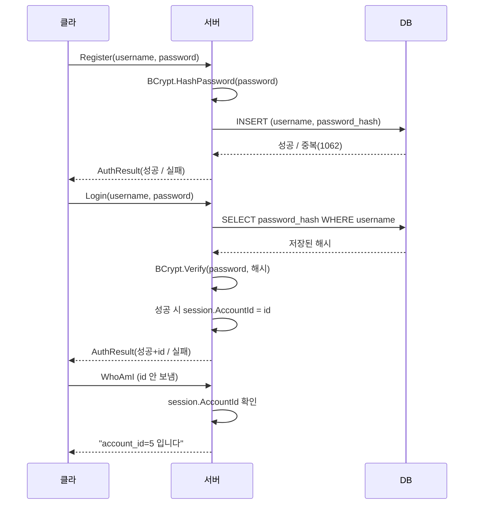

# 3단계 — 로그인 / 회원가입 (해싱 · 세션)

> 1단계(통신)와 2단계(DB)가 처음으로 합쳐지는 단계. 클라의 회원가입/로그인 요청을 서버가 받아 DB에 저장·검증하고, 로그인된 상태를 세션으로 기억한다.
> 이 단계의 목표는 **"진짜 주인인지 확인하고(인증), 확인된 상태를 안전하게 기억한다(세션)"**.
> ([← 전체 로드맵으로 돌아가기](../README.md))

---

## 1. 이 단계에서 만든 것

- **회원가입:** 비밀번호를 bcrypt로 해싱해 저장 (원본은 저장하지 않음)
- **로그인:** 저장된 해시와 입력을 비교해 검증 (`BCrypt.Verify`)
- **세션:** 로그인 성공 시 해당 연결(세션)에 신원(account_id)을 기록
- **접근 제어:** 로그인한 세션만 특정 요청(WhoAmI 등)을 수행

```
Unity 클라 ─(Register/Login 패킷)→ 서버 ─(해싱/검증)→ MySQL
   1단계 통신                                    2단계 DB
        ←──────(AuthResult 응답)──────────────
로그인 성공 시: session.AccountId = 5  (세션에 신원 기록)
```

---

## 2. 아키텍처

### 폴더 구조

**서버 (C# 콘솔)**
```
DedicatedServer/
├── Protocol/AuthData.cs      ← AuthRequest / AuthResponse (클라와 동일)
├── Net/
│   ├── DBManager.cs          ← RegisterAsync(해싱), LoginAsync(검증) 추가
│   ├── ClientSession.cs      ← AccountId 필드 추가 (세션)
│   └── PacketHandler.cs      ← Register / Login / WhoAmI 처리
```

**클라이언트 (Unity)**
```
Assets/Code/Scripts/Net/
├── AuthData.cs               ← AuthRequest / AuthResponse (서버와 동일)
└── AuthTester.cs             ← 회원가입/로그인/WhoAmI 테스트 UI
```

### 인증 흐름


---

## 3. 핵심 설계 판단과 트레이드오프

### 왜 비밀번호를 해싱하는가 (원본 저장 금지)
사람들은 여러 사이트에 같은/비슷한 비밀번호를 쓴다. DB가 유출되면 원본 비밀번호가 그대로 노출되어, 그 사용자의 다른 서비스(이메일·은행 등)까지 위험해진다. 그래서 **되돌릴 수 없게 변환한 해시만 저장**하고, 우리(서버 운영자)조차 원본을 모르게 한다. 로그인 시에는 입력을 같은 방식으로 해싱해 비교만 한다.

> 해싱은 "유출을 막는" 방어가 아니라 **"유출돼도 원본을 지키는"** 방어다. 유출 자체는 접근 제어·방화벽이 막고, 해싱은 최악의 경우 피해를 최소화한다.

### 왜 솔트가 필요한가
솔트가 없으면 같은 비밀번호(`1234`)는 누가 쓰든 항상 같은 해시가 된다. 공격자는 흔한 비밀번호의 해시를 **미리 계산한 표(레인보우 테이블)**로 대조해 원문을 알아낸다. 솔트는 비밀번호마다 랜덤 값을 섞어 **같은 비밀번호도 사람마다 다른 해시**가 되게 한다. 미리 만든 표가 무용지물이 되고, 공격자는 사람마다 따로 공격해야 해 비용이 폭증한다. (bcrypt는 솔트를 해시 문자열 안에 자동 포함한다.)

### 왜 bcrypt인가 (일부러 느린 해시)
SHA-256 같은 범용 해시는 너무 빨라 초당 수십억 번 대입이 가능하다. bcrypt는 **의도적으로 느리게** 설계되어(cost 파라미터로 반복 횟수 조절), 정상 로그인 한 번은 티가 안 나지만 무차별 대입 공격에는 치명적으로 느려진다. 저장된 해시 `$2a$11$...`에서 `$11$`이 cost로, 값이 클수록 느리고 안전하다. bcrypt 알고리즘 자체는 실제 유출 사고에서 깨진 적이 없으며, 사고는 대부분 약한 알고리즘 사용이나 구현 실수에서 발생했다.

### 왜 세션인가 (클라가 보낸 신원을 믿지 않는다)
로그인 이후 요청마다 신원이 필요하다. 만약 클라가 패킷에 "나 5번 계정이야"라고 써서 보내는 걸 서버가 믿으면, 누구나 남의 id를 써서 **사칭**할 수 있다. 그래서 로그인을 통과한 **연결(세션)에 서버가 직접 id를 기록**하고, 이후에는 클라가 보낸 값이 아니라 세션에 기록된 id를 신뢰한다. WhoAmI 요청에서 클라는 id를 보내지 않았는데도 서버가 정확히 응답하는 것이 이 방어의 증거다. — 1·2단계의 "입력을 믿지 않는다"가 신원으로 확장된 것.

### 계정 열거(enumeration) 방지
로그인 실패 시 "없는 아이디"와 "비밀번호 틀림"을 클라에는 동일한 메시지로 응답한다. 구분해서 알려주면 공격자가 "이 아이디는 존재한다"는 정보를 얻어 표적을 좁힐 수 있다. 서버 로그로는 구분(디버그용)하되, 클라 응답은 뭉뚱그린다.

### 실무에선 어떻게 다른가
- **세션 저장:** 여기서는 서버 메모리(ClientSession)에 세션을 둔다. 대규모 서비스는 서버가 여러 대라 Redis 등 외부 저장소에 세션을 두어 어느 서버로 붙어도 유지되게 한다.
- **토큰 인증:** 웹/모바일은 세션 대신 JWT 토큰을 많이 쓴다. 게임 서버는 연결 기반이라 세션 방식이 자연스럽다.
- **전송 암호화:** 현재 통신은 평문이라 로그인 정보가 네트워크 도청에 노출될 수 있다. 실무는 TLS로 전송을 암호화한다. (사칭은 세션이, 도청은 암호화가 막는 별개 방어 — 전송 암호화는 추가 단계 과제.)
- **해싱 알고리즘:** bcrypt 외 argon2, scrypt 등 더 최신 알고리즘도 있다. 원리(느린 해시 + 솔트)는 동일.

---

## 4. 러닝 로그 (설계 포인트)

> ① 문제 / 이유 · ② 상황 · ③ 방법 · ④ 짚고 갈 점

### (1) 원본 비밀번호를 저장하면 안 됨 → 해싱
- **① 문제 / 이유:** DB 유출 시 원본 비밀번호가 노출되면 사용자의 타 서비스까지 위험.
- **② 상황:** 2단계에서 `password_hash` 칸에 `temp_hash_value` 같은 가짜값만 넣어둔 상태.
- **③ 방법:** `BCrypt.Net.BCrypt.HashPassword(password)`로 해싱해 저장. 저장 결과는 `$2a$11$...` 형태.
- **④ 짚고 갈 점:** 해싱은 유출을 막는 게 아니라 유출돼도 원본을 지키는 방어. 서버조차 원본을 모른다.

### (2) 로그인은 역산이 아니라 재해싱 후 비교
- **① 문제 / 이유:** 원본을 저장하지 않는데 어떻게 비밀번호가 맞는지 확인하나?
- **② 상황:** 저장된 것은 되돌릴 수 없는 해시뿐.
- **③ 방법:** `BCrypt.Verify(입력비번, 저장된해시)` — 입력을 같은 방식(해시 속 솔트 사용)으로 처리해 저장된 해시와 비교.
- **④ 짚고 갈 점:** 해시는 되돌릴 수 없다. "비교"로 검증하지 "복원"으로 확인하지 않는다.

### (3) 세션에 신원 기록 — 사칭 방지
- **① 문제 / 이유:** 클라가 보낸 account_id를 믿으면 누구나 사칭 가능.
- **② 상황:** 로그인 이후 요청(WhoAmI 등)에서 신원이 필요.
- **③ 방법:** 로그인 성공 시 `session.AccountId = id` 기록. 이후 요청은 세션에 기록된 id를 사용. 클라는 id를 보내지 않음.
- **④ 짚고 갈 점:** 신뢰의 근원은 클라의 주장이 아니라 서버가 검증 후 기록한 세션 상태. 4·5단계 "이 데이터를 저장/조작할 권리가 있는가"의 토대.

### (4) 계정 열거 방지 — 실패 메시지 통일
- **① 문제 / 이유:** "없는 아이디" vs "비번 틀림"을 구분해 알려주면 아이디 존재 여부가 노출됨.
- **② 상황:** 로그인 실패 케이스가 두 가지(아이디 없음 / 비번 틀림).
- **③ 방법:** 클라에는 둘 다 "아이디 또는 비밀번호가 올바르지 않습니다"로 동일 응답. 서버 로그로만 구분.
- **④ 짚고 갈 점:** 공격자에게 주는 정보를 최소화. 편의(정확한 안내)와 보안(정보 은닉)의 트레이드오프에서 보안을 택함.

---

## 5. 패킷 프로토콜 (3단계 추가분)

| Type | 방향 | Data | 설명 |
|---|---|---|---|
| Register | C→S | username, password | 회원가입 요청 |
| Login | C→S | username, password | 로그인 요청 |
| WhoAmI | C→S | (없음) | 로그인 상태에서 내 신원 확인 |
| AuthResult | S→C | success, message, accountId | 인증 결과 공용 응답 |

---

## 6. 동작 확인 체크리스트

- [x] 회원가입 시 password_hash가 `$2a$11$...` 해시로 저장됨 (원본 아님)
- [x] 올바른 비밀번호로 로그인 성공, 틀린 비밀번호는 거부
- [x] 없는 아이디 로그인 시 실패 (클라엔 비번 틀림과 동일 메시지)
- [x] 로그인 전 WhoAmI → "로그인이 필요합니다" 거부
- [x] 로그인 후 WhoAmI → 클라가 id를 안 보내도 서버가 세션의 id로 응답
- [x] 서버 로그는 "없는 아이디" / "비번 틀림"을 구분(디버그용)

---

## 7. 이해 점검 질문

<details>
<summary><b>Q1. 왜 비밀번호 원본을 저장하지 않고, 서버조차 모르게 하나?</b></summary>

> 사람들은 여러 사이트에 같은/비슷한 비밀번호를 쓴다. DB가 유출되면 원본이 그대로 노출되어 사용자의 다른 서비스까지 위험해진다. 되돌릴 수 없는 해시만 저장하면, DB가 털려도 원본은 지켜진다. 해싱은 "유출을 막는" 게 아니라 **"유출돼도 원본을 지키는"** 방어다.
</details>

<details>
<summary><b>Q2. 같은 비밀번호 "1234"가 사람마다 다른 해시가 되어야 하는 이유는? (솔트가 없으면?)</b></summary>

> 솔트가 없으면 `1234`는 누가 쓰든 같은 해시가 된다. 공격자는 흔한 비밀번호의 해시를 **미리 계산한 표(레인보우 테이블)**로 대조해 원문을 알아낸다. (역산이 아니라 대조다 — 해시는 원래 되돌릴 수 없다.) 솔트는 비밀번호마다 랜덤 값을 섞어 같은 비밀번호도 사람마다 다른 해시가 되게 한다. 미리 만든 표가 무용지물이 되고, 공격자는 사람마다 개별 공격해야 해 비용이 폭증한다.
</details>

<details>
<summary><b>Q3. 로그인 성공 후 클라가 매 패킷에 "나 5번이야"라고 보내는 걸 믿으면 왜 안 되나?</b></summary>

> 클라가 보낸 id를 믿으면 누구나 남의 id를 써서 **사칭**할 수 있다(도청이 필요 없다 — 그냥 패킷에 숫자만 바꿔 쓰면 된다). 그래서 로그인을 통과한 **세션에 서버가 직접 id를 기록**하고, 이후에는 클라가 보낸 값이 아니라 세션의 id를 신뢰한다. 참고로 "네트워크 도청"은 이것과 별개의 위협으로, 세션이 아니라 전송 암호화(TLS)가 막는다. 세션은 사칭을, 암호화는 도청을 막는다.
</details>

---

## 8. "처음부터 다시 만든다면?" 회고

<details>
<summary><b>인증 로직을 DBManager에 둔 게 맞나?</b></summary>

> 지금은 해싱·검증을 DBManager에 넣었다. DB 접근과 인증 정책(해싱 방식, 실패 처리)이 한 클래스에 섞여 있어, 규모가 커지면 `AuthService`처럼 인증 전담 계층으로 분리하는 편이 낫다. DBManager는 순수 DB 접근만, AuthService는 정책만 담당하도록 나누면 테스트와 변경이 쉬워진다.
</details>

<details>
<summary><b>세션을 서버 메모리에 두는 방식의 한계는?</b></summary>

> 서버가 한 대일 때는 문제없지만, 서버가 여러 대로 늘면 "어느 서버에 로그인했는지"에 따라 세션이 갈린다. 서버가 재시작되면 모든 세션이 사라지는 문제도 있다. 실무는 Redis 등 외부 세션 저장소나 토큰(JWT) 방식으로 이를 해결한다. 학습 단계에서는 단순함을 위해 메모리 세션을 택했다.
</details>
