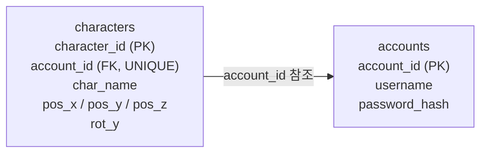
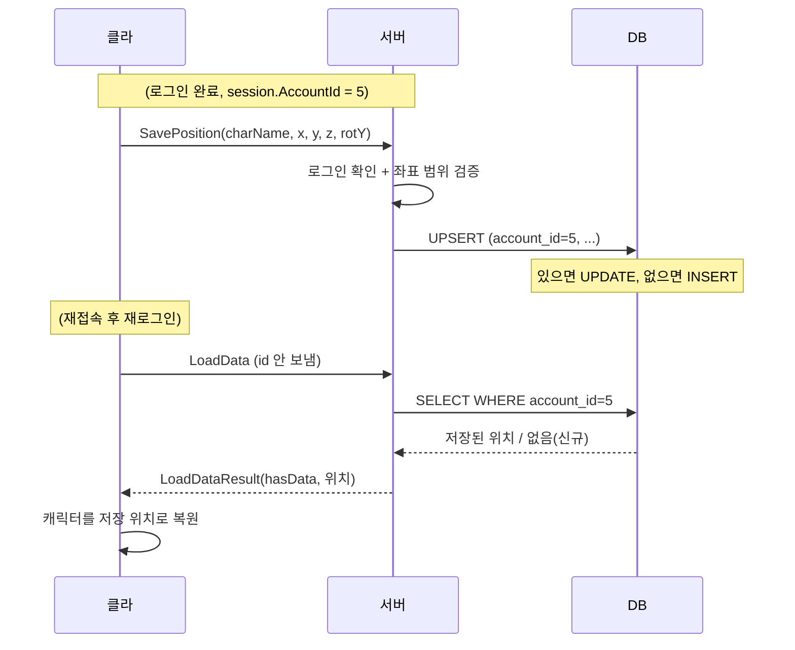

# 4단계 — 게임 데이터 저장 / 재접속 복원

> 로그인한 사용자의 게임 상태(위치·회전)를 DB에 저장하고, 재접속하면 복원한다.
> 3단계 세션의 `account_id`가 **"이 데이터가 누구의 것인가"**를 결정하는 열쇠가 된다.
> ([← 전체 로드맵으로 돌아가기](../README.md))

---

## 1. 이 단계에서 만든 것

- **characters 테이블:** accounts와 외래 키로 연결된 캐릭터 데이터(3D 위치 + Y축 회전)
- **저장:** 로그인한 세션의 위치를 UPSERT(있으면 UPDATE, 없으면 INSERT)로 저장
- **복원:** 재접속·재로그인 후 저장된 위치로 캐릭터를 되돌림
- **소유권:** 클라는 account_id를 보내지 않고, 서버가 세션의 id로 데이터 주인을 결정
- **값 검증:** 클라가 보낸 좌표의 범위를 서버가 검증(치팅 방지의 시작)

```
로그인 → session.AccountId = 5
위치 저장 → 서버가 "5번의 위치"로 저장 (클라는 id를 안 보냄)
재접속 → 재로그인 → 서버가 "5번의 저장 데이터"를 꺼내 복원
```

---

## 2. 아키텍처

### 폴더 구조

**서버**
```
DedicatedServer/
├── Protocol/GameData.cs      ← SavePositionRequest / LoadDataResponse (클라와 동일)
├── Net/
│   ├── DBManager.cs          ← SaveCharacterAsync(UPSERT), LoadCharacterAsync 추가
│   └── PacketHandler.cs      ← SavePosition / LoadData 처리 (세션 id 사용, 값 검증)
```

**클라이언트 (Unity)**
```
Assets/Code/Scripts/Net/
├── GameData.cs               ← SavePositionRequest / LoadDataResponse (서버와 동일)
└── GameTester.cs             ← 위치 저장/복원 테스트 UI (큐브를 캐릭터로 사용)
```

### 테이블 관계


### 저장/복원 흐름


---

## 3. 핵심 설계 판단과 트레이드오프

### 왜 새 테이블(characters)로 분리하는가
계정 정보(로그인)와 게임 데이터(플레이)는 성격이 다르다. 계정 정보는 거의 안 바뀌지만 게임 데이터는 자주 갱신된다. 성격과 변경 빈도가 다른 데이터는 테이블을 나누는 것이 원칙(정규화)이다. 한 계정이 캐릭터를 여러 개 가지는 확장도 대비된다. (더 커지면 로그인 서버와 게임 데이터 서버를 물리적으로 분리하기도 하지만, 그것은 훨씬 큰 규모의 이야기.)

### 왜 외래 키(FOREIGN KEY)인가
`characters.account_id`가 `accounts.account_id`를 참조하게 하면, DB가 **존재하지 않는 계정의 캐릭터를 만들지 못하도록 강제**한다(무결성). 코드로 "이 계정이 존재하나" 검사를 짜지 않아도 DB가 지켜준다. `ON DELETE CASCADE`로 계정 삭제 시 캐릭터도 자동 삭제해 고아 데이터를 방지한다. — 3단계의 "코드 검증(편의) + DB 제약(최종 보증)"과 같은 사고.

### 왜 UPSERT인가 (INSERT ... ON DUPLICATE KEY UPDATE)
재접속 저장은 "이미 있으면 갱신, 없으면 생성"이어야 한다. `account_id`에 UNIQUE를 걸어두면, INSERT가 중복될 때 자동으로 UPDATE로 전환된다. "먼저 SELECT로 존재 확인 → 분기"를 코드로 짜는 것보다 쿼리 한 번으로 끝나고, 동시 저장 시 경쟁 상태도 줄어든다.

### 무엇을 저장하고 무엇을 버리는가 (회전 설계)
위치는 x, y, z 모두 저장하지만, 회전은 **Y축(rot_y)만** 저장한다. 전체 회전(쿼터니언)을 저장하면 점프 중·애니메이션 포즈 중의 순간 자세까지 복원되어 오히려 부자연스럽다. 재접속은 "바닥에 똑바로 선 채, 마지막으로 바라보던 방향"으로 복원하는 것이 자연스럽다. **모든 상태가 아니라 복원에 의미 있는 상태만 저장한다**는 원칙.

### 언제 저장하는가 (저장 시점)
매 프레임 저장하면 DB가 과부하된다(특히 쓰기). 그래서 접속 종료·주기적·중요 이벤트 등 **의미 있는 시점에만** 저장한다. 이 단계에서는 명시적 저장 요청/접속 종료 기준으로 단순화했다. 실시간 위치 동기화(메모리에서 빠르게)와 DB 저장(가끔)은 다른 층위다. (동기화는 5단계.)

### 신원과 값 검증은 다른 층 (치팅 방지의 시작)
세션은 "누구인지"를 확인해 주지만, "그가 보낸 값이 정당한지"는 별개 문제다. 로그인한 5번이 맞아도 5번이 보낸 좌표가 (999999, ...)일 수 있다(순간이동 치트). 그래서 서버는 좌표 범위를 검증한다. 이 단계에서는 범위 상한만(가볍게), 이동 속도 기반 검증은 5단계에서 다룬다.

### 실무에선 어떻게 다른가
- **저장 빈도:** 실무 MMO는 "메모리에 상태 유지 + 주기적/이벤트성 DB 저장 + 캐시(Redis)"를 조합한다. 매번 DB에 쓰지 않는다.
- **좌표 검증:** 실무는 이동 속도 상한을 두고 물리적으로 가능한 이동인지 검증한다(순간이동 방지). 벽·맵 밖 등 영역 검증도 함께.
- **복잡한 데이터:** 인벤토리처럼 구조가 복잡한 데이터는 JSON 컬럼이나 별도 테이블로 저장한다. 이 단계는 위치부터 단순하게 시작.

---

## 4. 러닝 로그 (설계 포인트)

> ① 문제 / 이유 · ② 상황 · ③ 방법 · ④ 짚고 갈 점

### (1) 계정 데이터와 게임 데이터의 분리
- **① 문제 / 이유:** 성격·변경 빈도가 다른 데이터를 한 테이블에 두면 관리가 어려워진다.
- **② 상황:** accounts에 위치 컬럼을 추가할지, 새 테이블을 만들지 결정 필요.
- **③ 방법:** `characters` 테이블을 새로 만들고 외래 키로 accounts와 연결.
- **④ 짚고 갈 점:** 정규화 — 서로 다른 관심사의 데이터는 분리한다. 확장(다중 캐릭터)에도 유리.

### (2) 외래 키로 무결성 강제
- **① 문제 / 이유:** 존재하지 않는 계정의 캐릭터가 생기면 데이터가 깨진다(고아 데이터).
- **② 상황:** 없는 계정(999)으로 캐릭터 INSERT 시도.
- **③ 방법:** `FOREIGN KEY (account_id) REFERENCES accounts(account_id)`. 위반 시 에러 1452.
- **④ 짚고 갈 점:** 1062(중복 키)와 1452(외래 키 위반)는 대표적 무결성 에러. DB가 관계를 강제해 코드 부담을 던다.

### (3) UPSERT로 저장/갱신 통합
- **① 문제 / 이유:** 재접속 저장은 신규면 INSERT, 기존이면 UPDATE여야 한다.
- **② 상황:** 같은 계정이 위치를 여러 번 저장(세션 1에서 2회).
- **③ 방법:** `INSERT ... ON DUPLICATE KEY UPDATE` + account_id UNIQUE. 결과적으로 행은 계정당 하나만 유지.
- **④ 짚고 갈 점:** "SELECT 후 분기"보다 한 쿼리가 간결하고 경쟁 상태에 강하다. 저장 후 characters에 account_id=5가 한 줄뿐인 것이 증거.

### (4) 세션이 데이터 소유권을 결정
- **① 문제 / 이유:** 클라가 "누구의 데이터"인지 지정하면 남의 데이터를 조작할 수 있다.
- **② 상황:** SavePosition/LoadData 요청에 account_id가 없음.
- **③ 방법:** 서버가 `session.AccountId`로 저장·조회 대상을 결정. 클라는 좌표만 보냄.
- **④ 짚고 갈 점:** 3단계 세션이 4단계에서 "데이터의 주인"을 정하는 열쇠로 작동. 사칭이 원천 차단된다.

### (5) 신원과 별개의 값 검증
- **① 문제 / 이유:** 로그인한 사용자라도 비정상 좌표를 보낼 수 있다(치팅).
- **② 상황:** 클라가 임의 좌표를 SavePosition으로 전송.
- **③ 방법:** 서버에서 좌표 범위 상한(±10000)을 검증해 벗어나면 저장 거부.
- **④ 짚고 갈 점:** "누구인지(세션)"와 "값이 정당한지(검증)"는 다른 층. 이동 속도 기반 검증은 5단계로 확장.

---

## 5. 패킷 프로토콜 (4단계 추가분)

| Type | 방향 | Data | 설명 |
|---|---|---|---|
| SavePosition | C→S | charName, posX/Y/Z, rotY | 현재 위치 저장 (account_id는 안 보냄) |
| LoadData | C→S | (없음) | 저장된 데이터 요청 |
| LoadDataResult | S→C | hasData, charName, posX/Y/Z, rotY | 복원 데이터 (없으면 hasData=false) |

---

## 6. 동작 확인 체크리스트

- [x] characters 테이블 생성, 외래 키(account_id → accounts) 작동 (없는 계정 INSERT 시 1452)
- [x] 로그인 후 위치 저장 → DB에 좌표·회전 기록
- [x] 같은 계정 2회 저장 시 행이 하나만 유지됨 (UPSERT/UPDATE)
- [x] 재접속·재로그인 후 복원 → 캐릭터가 저장 위치로 이동
- [x] 미로그인 상태의 저장/복원 요청 거부
- [x] 신규 계정 복원 요청 시 "데이터 없음(신규)" 처리
- [x] 범위를 벗어난 좌표 저장 거부

---

## 7. 이해 점검 질문

<details>
<summary><b>Q1. 왜 위치를 accounts 테이블에 컬럼으로 추가하지 않고, 새 테이블(characters)로 분리했나?</b></summary>

> 계정 정보와 게임 데이터는 성격이 다르고 변경 빈도도 다르다(계정은 거의 불변, 위치는 자주 갱신). 서로 다른 관심사의 데이터를 한 테이블에 섞으면 관리가 어렵고, 확장(한 계정에 캐릭터 여러 개)도 막힌다. 그래서 별도 테이블로 분리하고 외래 키로 연결한다(정규화).
</details>

<details>
<summary><b>Q2. 플레이어가 움직일 때마다 매 프레임 DB에 저장하면 왜 안 되나? 그럼 언제 저장하나?</b></summary>

> 초당 수십 번 위치가 바뀌는데 매번 DB에 쓰면(특히 쓰기 부하) DB가 과부하로 터진다. 그래서 접속 종료·주기적·중요 이벤트 등 의미 있는 시점에만 저장한다. 실시간 위치 공유는 메모리에서 빠르게 처리(5단계 동기화)하고, DB 저장은 가끔 하는 별개의 층이다.
</details>

<details>
<summary><b>Q3. 클라가 "내 위치를 (999999, 999999, 999999)에 저장해줘"라고 보내면 서버는 믿어야 하나?</b></summary>

> 믿으면 안 된다. 세션은 "누구인지(로그인한 5번)"는 확인해 주지만, "그가 보낸 값이 정당한지"는 별개 문제다. 로그인한 사용자라도 비정상 좌표(순간이동 치트)를 보낼 수 있으므로 서버가 값을 검증해야 한다. 이 단계에서는 범위 상한으로 가볍게 막고, 이동 속도 기반 검증(이전 위치와의 거리로 물리적 가능성 판단)은 5단계에서 다룬다.
</details>

---

## 8. "처음부터 다시 만든다면?" 회고

<details>
<summary><b>위치를 pos_x, pos_y, pos_z 컬럼 3개로 나눈 게 최선인가?</b></summary>

> 컬럼을 나누면 SQL로 특정 축을 조회·정렬하기 쉽고 명확하다. 다만 저장 데이터가 늘면(속도, 스케일 등) 컬럼이 계속 늘어난다. 인벤토리처럼 구조가 복잡해지는 데이터는 JSON 컬럼이나 별도 테이블이 더 낫다. 위치처럼 고정적이고 조회가 잦은 값은 컬럼 분리가 적절하다 — 데이터 성격에 따라 선택.
</details>

<details>
<summary><b>저장 시점을 명시적 버튼/접속 종료로 둔 한계는?</b></summary>

> 접속 종료 시에만 저장하면, 서버·클라가 비정상 종료(크래시)될 경우 마지막 상태를 잃는다. 실무는 주기적 자동 저장(N초마다)이나 중요 이벤트 시 저장을 병행해 손실 구간을 줄인다. 저장 빈도와 DB 부하는 트레이드오프이며, 게임 특성에 맞춰 조절한다.
</details>
