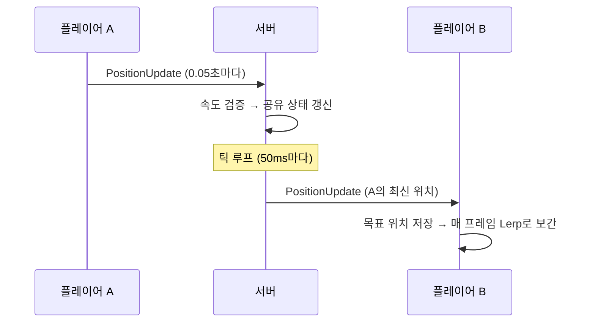

# 5단계 — 멀티플레이 (동기화 · 보간 · 채팅 · 치팅 방지)

> 여러 명이 같은 공간에 동시에 존재하고, 서로의 움직임을 실시간으로 본다.
> 지금까지의 모든 단계(통신·DB·인증·데이터)가 여기서 하나로 엮인다.
> ([← 전체 로드맵으로 돌아가기](../README.md))

---

## 1. 이 단계에서 만든 것

- **공유 상태(GameWorld):** 접속 중인 모든 플레이어를 서버가 관리 (동시성 안전)
- **접속/이탈:** 입장 시 기존 멤버 안내 + 전원 알림, 이탈 시 제거 + 알림
- **위치 동기화:** 각자 위치를 서버에 보내면, 서버가 틱레이트(20Hz)로 전원에게 전파
- **보간:** 띄엄띄엄 오는 위치를 부드럽게 이어서 표시
- **채팅:** 메시지를 전원(나 포함)에게 즉시 전파
- **치팅 방지:** 이동 속도 검증 + 비정상 이동 시 서버가 위치를 교정

```
A 이동 → 서버(공유 상태 갱신 + 속도 검증) → 틱마다 B·C·D에게 전파
         B·C·D 화면에서 A가 보간되어 부드럽게 움직임
A 로그인 → 서버가 저장 위치로 입장시키고, A에게 시작 위치를 교정 전송
```

---

## 2. 아키텍처

### 근본적 전환: 요청-응답 → 전파(broadcast)
1~4단계는 "클라 1명 ↔ 서버"의 요청-응답이었다. 5단계는 **A가 보낸 것을 서버가 A가 요청하지 않은 다른 사람들에게 밀어주는(broadcast)** 구조다. B는 아무것도 요청하지 않았는데 A의 위치가 도착한다.

### 폴더 구조

**서버**
```
DedicatedServer/
├── Protocol/MultiplayerData.cs  ← PlayerInfo, PositionUpdate, ChatMessage 등
├── Net/
│   ├── PlayerState.cs           ← 서버가 아는 각 플레이어 상태 (+마지막 이동 시각)
│   ├── GameWorld.cs             ← 공유 상태(ConcurrentDictionary), 입장/이탈/전파/검증
│   ├── ClientSession.cs         ← 이탈 시 GameWorld에서 제거
│   └── PacketHandler.cs         ← PositionUpdate/Chat 처리, 로그인 시 입장
└── Program.cs                   ← 틱 루프(20Hz) 추가
```

**클라이언트 (Unity)**
```
Assets/Code/Scripts/Net/
├── MultiplayerData.cs           ← 서버와 동일
├── RemotePlayerManager.cs       ← 다른 플레이어 큐브 생성/보간/제거
├── GameTester.cs                ← 내 위치 전송 + 서버 교정 수신
└── ChatTester.cs                ← 채팅 UI
```

### 위치 동기화 흐름


---

## 3. 핵심 설계 판단과 트레이드오프

### 공유 상태와 동시성 (ConcurrentDictionary)
서버는 "접속 중인 모든 플레이어" 목록을 하나 가진다. 그런데 여러 세션의 Task가 이 목록을 **동시에** 읽고 쓴다(A 입장, B 조회, C 퇴장이 겹침). 일반 `Dictionary`는 동시 접근에 안전하지 않아 경쟁 상태로 깨진다. 그래서 `ConcurrentDictionary`를 쓴다 — 1단계 클라의 `ConcurrentQueue`와 같은 계열의 "동시 접근 안전 자료구조". 4단계에서 씨앗만 심었던 동시성 문제가 여기서 실제로 필요해진다.

### 매 프레임 전송 vs 고정 틱레이트
플레이어가 움직일 때마다 즉시 전파하면, 초당 수십~수백 패킷 × 인원수로 폭발한다. 그래서 위치 변경은 값만 갱신하고(`UpdatePosition`), 실제 전파는 **고정 주기(50ms = 20Hz)**로 모아서 한다(`TickBroadcastAsync`). 그 사이 100번 움직였어도 "최신 위치 하나"만 전파한다. 대부분의 게임이 서버 틱 20~60Hz를 쓴다.

### 보간 (부드러움 vs 지연)
20Hz로 위치가 오면 화면에서 상대는 0.05초마다 순간이동한다. 받은 위치를 **목표로만 저장**하고 매 프레임 `Vector3.Lerp`로 목표를 향해 조금씩 이동시키면, 데이터는 띄엄띄엄이어도 화면은 60fps로 부드럽다. 트레이드오프: 화면의 상대는 실제보다 살짝 과거다(목표로 다가가는 중). 부드러움을 위해 약간의 지연을 감수한다.

### 첫 위치는 보간하지 않고 스냅
새로 생성된 원격 큐브를 첫 프레임부터 보간하면, 원점(0,0,0)에서 실제 위치까지 "날아오는" 현상이 생긴다. 그래서 **생성 직후 첫 위치는 즉시 적용(스냅)**하고, 그 이후 갱신부터 보간한다.

### 서버 권위 — 클라를 통제하는 게 아니라, 거짓을 전파하지 않는 것
치팅 방지의 본질. 서버는 치터의 클라 화면을 바꿀 수 없다(치터 PC 안의 일). 서버가 할 수 있는 건 **그 거짓 위치를 다른 사람에게 전파하지 않는 것**이다. 그래서 속도 검증에 걸린 이동은 거부하고, 다른 플레이어에게는 이전 위치만 전파한다. 치터만 혼자 다른 세상을 볼 뿐, 남들은 서버의 진실을 본다.

### 서버 교정 (reconciliation)
거부만 하면 치터 클라는 계속 잘못된 위치를 보내 로그를 도배하고 자기 화면은 어긋난 채다. 그래서 서버가 "네 진짜 위치는 여기다"를 되돌려 보내(`PositionCorrection`), 치터 클라를 강제로 제자리로 당긴다. 치터가 순간이동하려다 고무줄처럼 되돌아오는 현상이 이것. 실무의 "클라 예측 + 서버 교정" 패턴의 축소판.

### 이동 속도 검증의 한계 (정당한 순간이동)
속도 검증은 "일반 이동"에만 유효하다. 텔레포트·포탈·리스폰 같은 **정당한 순간이동**은 물리적으로 속도 검증에 걸린다. 실무는 이를 "위치 변경의 주도권"으로 구분한다 — **클라가 일방적으로 주장하는 이동은 검증하고, 서버가 주도하는 이동(텔레포트·리스폰)은 검증을 건너뛴다.** 이 프로젝트는 일반 이동만 있어 속도 검증으로 충분하지만, 실제 게임은 서버 주도 이동 목록을 별도 관리해야 한다.

### 채팅 — 위치 전파의 텍스트 버전
구조는 위치 전파와 같되 두 가지가 다르다: (1) 나 포함 **전원**에게(내 메시지도 보여야 함), (2) 틱 없이 **즉시**(자주 안 일어남). 그리고 채팅은 **반드시 도착해야** 하므로 TCP의 신뢰성이 딱 맞는다 — 1단계에서 TCP를 택한 이유가 여기서 빛난다.

### 실무에선 어떻게 다른가
- **프레임워크:** 직접 짠 전파·보간·틱·연결관리는 실무에선 Mirror/Photon/Netcode/FishNet이 처리한다. 직접 구현은 내부 원리를 이해하기 위함.
- **UDP:** 실무 FPS는 위치를 UDP로 보낸다(최신값만 중요, 유실 허용). 이 프로젝트는 TCP로 하되 "왜 TCP로 매 프레임 좌표를 쏘면 안 되는가"를 틱레이트로 체감했다.
- **관심 영역(AoI):** 실무는 "내 근처 사람"에게만 전파해 부하를 줄인다. 이 프로젝트는 전체 전파로 단순화.
- **클라 예측:** 실무는 내 캐릭터를 입력 즉시 움직이고(예측) 서버 결과와 다르면 보정한다. 여기서는 서버 교정만 맛봤다.

---

## 4. 러닝 로그 (실전 문제)

> ① 문제 / 이유 · ② 상황 · ③ 방법 · ④ 짚고 갈 점

### (1) 같은 계정 중복 로그인 → 공유 목록 덮어쓰기
- **① 문제 / 이유:** GameWorld가 account_id를 key로 쓰는데, 두 클라가 같은 계정으로 로그인하면 같은 key가 덮어써진다.
- **② 상황:** 두 테스트 창이 모두 기본값 player1로 로그인 → "현재 1명"에서 안 늘어남.
- **③ 방법:** 테스트는 서로 다른 계정으로. (근본적으로는 "이미 로그인된 계정이면 기존 세션 강제 종료 또는 두 번째 거부" 처리가 필요 — 확장 과제.)
- **④ 짚고 갈 점:** 딕셔너리 key 충돌이 조용히 데이터를 덮어써 유령 세션을 만든다. 중복 로그인 처리는 실제 게임 서버의 필수 요소.

### (2) 위치 전송이 안 됨 → 로그인 상태 불일치
- **① 문제 / 이유:** 전파(broadcast)가 안 되어 상대 움직임이 안 보임.
- **② 상황:** 두 창이 같은 계정이라 공유 목록에 실제로 한 명만 있어서 전파 대상이 없었음.
- **③ 방법:** (1)의 해결과 동일 — 다른 계정으로 로그인하니 "현재 2명"이 되고 전파 정상.
- **④ 짚고 갈 점:** "전파가 안 된다"의 원인이 전파 코드가 아니라 공유 상태(1명뿐)에 있었다. 증상과 원인의 위치가 다를 수 있다.

### (3) MPPM 가상 플레이어가 키보드 입력을 못 받음
- **① 문제 / 이유:** Unity 레거시 Input(`Input.GetAxis`)은 MPPM 가상 플레이어 창에서 무시된다(키보드는 물리적으로 하나뿐이라 창끼리 나눠 가질 수 없음).
- **② 상황:** 메인 에디터 창은 WASD가 되는데 가상 플레이어 창은 안 됨.
- **③ 방법:** 이동을 UI 버튼(OnGUI)으로 대체. (실제 조작이 필요하면 빌드된 실행 파일로 테스트.)
- **④ 짚고 갈 점:** 멀티플레이 테스트 환경의 실질적 제약. 테스트 방식(MPPM/버튼/빌드)을 상황에 맞게 선택.

### (4) 백그라운드 창이 렌더링을 멈춤
- **① 문제 / 이유:** Unity는 포커스를 잃은 창의 렌더링을 늦춘다. 그래서 상대 창을 클릭해야 화면이 갱신됨.
- **② 상황:** 한 창에서 움직여도 다른 창은 클릭하기 전까지 갱신 안 됨.
- **③ 방법:** Project Settings > Player > Run In Background 활성화.
- **④ 짚고 갈 점:** 멀티플레이 게임은 포커스와 무관하게 계속 돌아야 하므로 이 설정이 사실상 필수.

### (5) 첫 위치 보간으로 "날아오는" 현상
- **① 문제 / 이유:** 새로 생성된 원격 큐브가 첫 프레임부터 Lerp 대상이 되어, 생성 위치(원점)에서 실제 위치로 미끄러져 옴.
- **② 상황:** 상대가 처음 나타날 때 먼 데서 스르륵 날아옴.
- **③ 방법:** 생성 직후 첫 위치는 스냅(즉시 적용), 이후만 보간.
- **④ 짚고 갈 점:** 보간은 "연속된 갱신"에만 자연스럽다. 최초 배치는 예외로 처리.

### (6) 고빈도 로그가 콘솔을 도배
- **① 문제 / 이유:** 모든 수신 패킷을 로그로 찍는데, PositionUpdate가 초당 20번×인원수로 쏟아짐.
- **② 상황:** `[세션 N] 수신 type=PositionUpdate`로 콘솔이 가득 참.
- **③ 방법:** 특정 고빈도 타입(PositionUpdate)만 로그에서 제외.
- **④ 짚고 갈 점:** 로그 레벨 관리의 축소판. 고빈도 이벤트는 평소 숨기고 필요 시만 본다.

### (7) 로그인 직후 위치 불일치 → 치팅 오판
- **① 문제 / 이유:** 로그인 시 서버는 DB 저장 위치로 입장시키는데, 클라 큐브는 (0,0,0)에 남아 있어 첫 전송이 "순간이동"으로 오판됨.
- **② 상황:** 로그인하자마자 치팅 로그가 뜨고 위치가 어긋남.
- **③ 방법:** 로그인 성공 시 서버가 본인에게 시작 위치를 `PositionCorrection`으로 전송 → 클라 큐브를 그 위치에 배치. 처음부터 클라·서버 위치 일치.
- **④ 짚고 갈 점:** 클라-서버 상태 초기화 동기화 문제. 세션 시작 시 양쪽 상태를 명시적으로 맞춰야 한다.

---

## 5. 패킷 프로토콜 (5단계 추가분)

| Type | 방향 | Data | 설명 |
|---|---|---|---|
| PlayerJoin | S→C | PlayerInfo | 플레이어 입장(기존 멤버 + 신규) |
| PlayerLeave | S→C | accountId | 플레이어 퇴장 |
| PositionUpdate | C→S / S→C | posX/Y/Z, rotY (+accountId) | 위치 갱신(클라→서버)·전파(서버→클라) |
| PositionCorrection | S→C | posX/Y/Z, rotY | 서버 교정(치팅 거부·시작 위치) |
| Chat | C→S / S→C | text (+sender) | 채팅(전원 전파) |

---

## 6. 동작 확인 체크리스트

- [x] 두 계정 로그인 시 서버 "현재 2명", 서로의 큐브가 화면에 보임
- [x] 한 명이 이동하면 다른 화면의 큐브가 (보간되어 부드럽게) 따라 움직임
- [x] 접속 해제/연결 끊김 시 상대 화면에서 큐브가 사라짐
- [x] 채팅 메시지가 전원(나 포함)에게 표시됨
- [x] 비정상 순간이동 시 서버가 거부(로그) + 교정 → 치터가 제자리로, 남에게는 안 보임
- [x] 로그인 직후 큐브가 저장 위치에 배치되어 치팅 오판이 없음

---

## 7. 이해 점검 질문

<details>
<summary><b>Q1. A가 움직일 때마다 즉시 전파하는 것과 0.05초마다 모아서 전파하는 것의 차이는? 왜 후자를 쓰나?</b></summary>

> 즉시 전파하면 A가 초당 수십~수백 번 움직일 때 그만큼의 패킷 × 인원수가 발생해 폭발한다. 고정 틱레이트(20Hz)는 그 사이 아무리 많이 움직여도 "최신 위치 하나"만 주기적으로 전파해 트래픽을 일정하게 유지한다. 중간값은 어차피 최신값으로 덮이므로 버려도 된다.
</details>

<details>
<summary><b>Q2. 서버가 0.05초마다만 위치를 보내는데 화면은 왜 부드럽게 만들 수 있나?</b></summary>

> 받은 위치를 즉시 적용(순간이동)하지 않고 "목표"로 저장한 뒤, 매 프레임 현재 위치에서 목표를 향해 조금씩(Lerp) 이동시키기 때문이다(보간). 데이터는 20Hz로 띄엄띄엄 오지만 화면은 60fps로 목표를 향해 계속 미끄러지므로 부드럽다. 대가로 화면의 상대는 실제보다 약간 과거다.
</details>

<details>
<summary><b>Q3. 여러 플레이어의 Task가 공유 목록을 동시에 만지면 왜 위험한가? ConcurrentDictionary를 쓰는 이유는?</b></summary>

> 각 세션이 독립 Task로 돌며 같은 목록을 동시에 읽고 쓴다(추가/삭제/조회가 겹침). 일반 Dictionary는 동시 접근 중 내부 구조가 깨져 경쟁 상태·크래시가 난다. ConcurrentDictionary는 동시 접근을 내부적으로 안전하게 처리해, 여러 스레드가 같은 목록을 만져도 깨지지 않는다.
</details>

<details>
<summary><b>Q4. 채팅은 반드시 도착해야 하고 위치는 최신값만 오면 되는데, 이 차이가 TCP/UDP 선택과 어떻게 연결되나?</b></summary>

> 채팅은 하나라도 유실되면 대화가 깨지므로 신뢰성(재전송·순서 보장)이 필요하다 → TCP가 맞다. 위치는 유실돼도 다음 최신값이 곧 오므로, 신뢰성보다 최신성이 중요하다 → 실무는 UDP를 쓴다. 이 프로젝트는 학습을 위해 전부 TCP로 하되, 위치는 틱레이트로 "굳이 모든 값을 신뢰성 있게 보낼 필요가 없다"는 감각을 익혔다.
</details>

---

## 8. "처음부터 다시 만든다면?" 회고

<details>
<summary><b>전체 전파(모두에게) 방식의 한계는?</b></summary>

> 접속자가 늘수록 전파량이 인원수의 제곱으로 증가한다(N명이면 N×N). 실무는 관심 영역(AoI)을 두어 "내 주변 플레이어"에게만 전파해 부하를 줄인다. 대규모에서는 지역(존) 분할, 서버 분산도 병행한다. 이 프로젝트는 소규모 학습이라 전체 전파로 단순화했다.
</details>

<details>
<summary><b>여러 테스터 컴포넌트가 각자 Connect/OnPacket을 하는 구조가 맞았나?</b></summary>

> AuthTester·GameTester·ChatTester·RemotePlayerManager가 각자 NetworkManager에 붙어 패킷을 처리하다 보니, 연결 중복이나 책임 분산이 지저분해졌다. 네트워크 연결·수신을 한 곳(NetworkManager)이 관장하고 각 기능은 필요한 패킷만 구독하는 구조가 더 깔끔하다. 학습 중 점진적으로 붙이다 보니 이렇게 됐고, 리팩토링 대상이다.
</details>

---

## 9. 전체 프로젝트를 마치며

1단계에서 "TCP는 바이트 스트림"이라는 한 문장으로 시작해, 5단계에서 여러 명이 실시간으로 함께 움직이는 지점까지 왔다. 각 단계의 핵심 사고가 다음 단계의 토대가 되었다:

- **1단계(프레이밍):** 입력을 믿지 않는다 → 이후 모든 검증의 뿌리
- **2단계(DB):** 파라미터 바인딩 → 입력 불신이 SQL로 확장
- **3단계(인증):** 세션 → 서버가 신원을 기록, 클라 사칭 차단
- **4단계(데이터):** 세션이 데이터 소유권 결정, 값 검증의 시작
- **5단계(멀티):** 서버 권위 완성 — 클라의 거짓을 전파하지 않고 교정

관통하는 원칙은 하나다: **서버가 진실을 정하고, 클라의 주장은 검증한다.**
