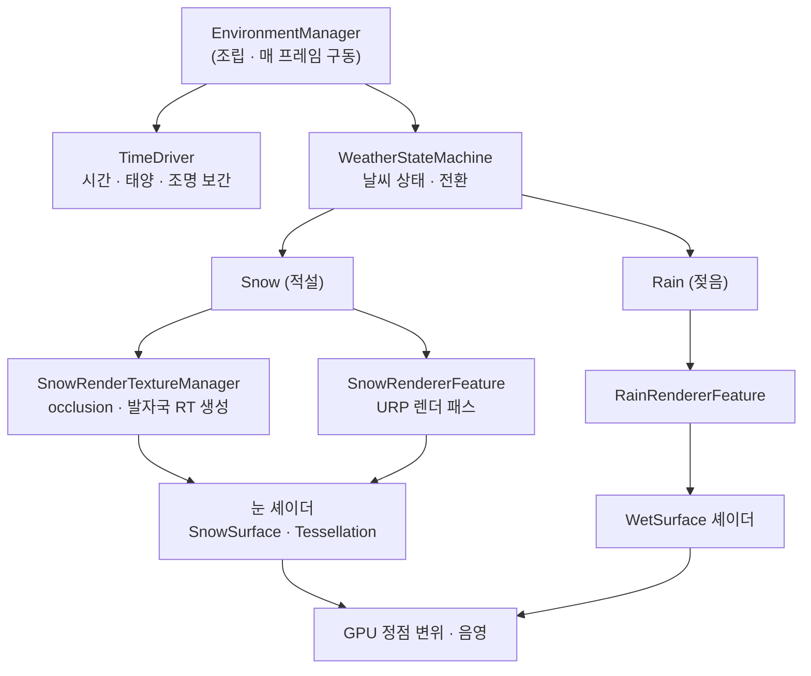

# Environment System

> Unity URP 기반 **눈 · 비 · 시간** 환경 시스템.
> 적설 표현을 **메시 정점 변형 방식에서 RenderTexture 기반 방식으로 전환**하며 설계했습니다.

<!-- mesh, RT 비교 gif -->
<!-- 전체 시연 영상 (YouTube) -->

---

## 개요

지형 위에 눈이 쌓이고, 발자국이 찍히고, 비가 표면을 적십니다. 시간이 흐르며 태양 · 조명 · 날씨가 전환됩니다.

시스템의 핵심은 **눈(snow)** 이며, 이를 구현하던 중 부딪힌 **성능 한계 때문에 mesh에서 RT(RenderTexture) 방식으로 전환**한 과정이 이 프로젝트의 중심입니다. 자세한 내용은 아래에서 다룹니다.

이 문서는 전체 개요이며, 모듈별 상세는 각 폴더의 README로 연결됩니다.

---

## 시스템 한눈에

환경은 네 개의 독립 모듈로 나뉘며, `EnvironmentManager`가 이들을 조립 · 구동합니다.

| 모듈 | 하는 일 | 상세 |
|---|---|---|
| **TimeSystem** | 태양 각도를 진행시켜 시간대(일출/낮/일몰/밤)를 정하고, 조명 색온도·세기를 보간합니다. | [README](./TimeSystem/README.md) |
| **Weather** | 날씨 상태(눈/비/맑음)를 전환하고, 전환 시 강도를 페이드합니다. | [README](./Weather/README.md) |
| **Snow** (핵심) | 눈쌓임을 표현합니다. 천장 밑 눈 제거(occlusion), 발자국, 표면 변위를 RT 기반으로 처리합니다. | [README](./Weather/Snow/README.md) |
| **Rain** | RT occlusion을 공유해 비가 닿는 표면만 젖게 만듭니다. | [README](./Weather/Rain/README.md) |

---

## 시스템 아키텍처

모듈 간 관계와 데이터 흐름은 다음과 같습니다. `EnvironmentManager`가 시간·날씨를 구동하고, 눈·비는 RT와 셰이더를 거쳐 GPU에서 표면으로 그려집니다.

### 매 프레임 흐름

`EnvironmentManager`가 한 프레임에 시간 → 날씨 → 표면 갱신을 순서대로 구동합니다.

---

## 최적화를 위해 걸었던 길 — mesh에서 RT로

### 처음 방식: 메시 정점 변형

처음에는 눈을 **메시 정점 변형**으로 구현했습니다. 지형 메시를 런타임에 세분화하고, 정점을 눈 높이만큼 끌어올려 쌓인 눈을 표현하는 방식입니다.

### 부딪힌 벽: CPU 비용

가장 큰 문제는 **CPU 비용**이었습니다. 메시 세분화와 정점 처리가 CPU에 집중되었고, 작업을 **멀티코어로 분산해도 프레임 저하가 해소되지 않았습니다.** 눈이 쌓이는 범위가 넓어질수록 CPU가 병목이 되어, 이 방향으로는 한계가 분명했습니다.

(청크 경계의 이음새, 세분화 과정의 T-junction 균열 같은 문제도 있었지만 부차적이었고, 핵심은 성능이었습니다.)

### 해결: 작업을 GPU로 옮기다

그래서 눈쌓임을 "메시"가 아니라 **"텍스처(RT) + 셰이더 변위"** 로 재설계했습니다.

- 적설량 · 발자국을 **RenderTexture에 그리고**, 셰이더가 이 텍스처를 읽어 **GPU에서 정점을 변위**시킵니다.
- CPU가 매 프레임 메시를 깎던 작업이 사라지고, **GPU가 병렬로 표면을 변형**합니다.

| | mesh 방식 (이전) | RT 방식 (현재) |
|---|---|---|
| 눈 표현 | 메시 정점을 CPU에서 변형 | RT를 읽어 GPU 셰이더에서 변위 |
| 주 부하 | **CPU** (멀티코어로도 병목) | **GPU** |
| 발자국 | 메시에 직접 반영 | RT에 누적 (stamp/fade/shift) |
| occlusion | 개별 처리 | RT 파이프라인으로 통합 |
| 확장성 | 범위 ↑ → CPU 부하 급증 | 범위와 무관하게 RT 단위 처리 |

**결과 (에디터 측정)**

- 메인 스레드 평균 시간: **25.7 → 19.5 ms (−24%)**
- 평균 프레임률: **38.9 → 51.4 FPS (+32%)**
- 최악 프레임: **456 → 119 ms (−74%)** — 큰 스터터가 크게 줄었습니다.

두 방식 모두 *메인 스레드 시간 ≈ 프레임 시간* 이라 **CPU가 병목**임이 확인되며, 눈 처리를 GPU로 옮겨 그 병목을 완화했습니다.

> 측정 방법과 전체 수치 → **[Snow의 mesh vs RT 성능 비교](./Benchmark/README.md)**
> 눈 시스템의 상세 구현 → **[Weather/Snow/README.md](./Weather/Snow/README.md)**
>
> 두 방식 모두 유지하고 있어 시연 영상에서 직접 비교합니다.

### 새로 익힌 도구: ScriptableRendererFeature

RT를 매 프레임 갱신하고 렌더 파이프라인에 끼워 넣기 위해, Unity URP의 **`ScriptableRendererFeature`** 를 이 프로젝트에서 처음 사용했습니다. MonoBehaviour에 익숙한 입장에서 다음 대응 관계를 잡고 나니 구조가 빠르게 이해됐습니다.

- `Create()` ≈ `Start()` — 패스 초기 1회 셋업
- `AddRenderPasses()` ≈ `Update()` — 매 프레임 렌더 큐에 패스 등록

---

## 핵심 기능

각 항목의 상세 구현 · 코드 발췌는 링크된 README에 있습니다.

### Sky Occlusion
천장 아래나 실내에는 눈 · 비가 닿지 않아야 자연스럽습니다. 이를 위해 **BFS 거리장**을 계산해 "하늘이 얼마나 열려 있는가"를 구하고, **5×5 타일 아틀라스 텍스처**에 구워 셰이더에서 소비합니다. 표면 셰이더는 이 값으로 천장 밑 눈을 잘라냅니다. → [Snow](./Weather/Snow/README.md)

### 발자국 RT 파이프라인
발자국을 `stamp → fade → shift` 3단계 RT로 처리합니다. 밟은 자리에 자국을 **누적(stamp)** 하고, 시간이 지나면 **감쇠(fade)** 시켜 눈이 메워지며, 플레이어가 움직이면 RT 중심을 **이동(shift)** 시켜 정렬합니다. → [Snow](./Weather/Snow/README.md)

### 적응형 테셀레이션
카메라 거리에 따라 표면을 세분화하되, 세분화 경계에서 생기는 **T-junction 균열을 중간점 공유로 방지**합니다. → [Snow](./Weather/Snow/README.md)

### 시간 · 날씨 연동
태양 각도가 시간대 상태(일출/낮/일몰/밤)를 구동하고, 날씨는 강도 페이드로 전환됩니다. → [TimeSystem](./TimeSystem/README.md) · [Weather](./Weather/README.md)

---

## 설계에서 신경 쓴 점

- **모듈 분리** — 시간 / 날씨 / 눈 / 비를 독립 모듈로 두고, `EnvironmentManager`가 조립만 담당하도록 구성했습니다. 한 모듈을 수정해도 다른 모듈에 영향이 가지 않습니다.
- **레거시 보존** — mesh 방식을 지우지 않고 격리해 보존했습니다. RT 방식과 직접 비교할 수 있게 하기 위함입니다.
- **CPU → GPU 역할 재배치** — "어떤 작업을 어느 장치가 맡는 게 맞는가"를 성능 관점에서 다시 판단한 것이 이 프로젝트의 핵심 학습입니다.

---

## 기술 스택

- **Unity** / **URP** (Universal Render Pipeline)
- **C#** — 시스템 로직, 상태 머신, RT 관리
- **HLSL / ShaderLab** — 표면 변위, 테셀레이션, occlusion 소비
- **ScriptableRendererFeature** — 커스텀 렌더 패스
