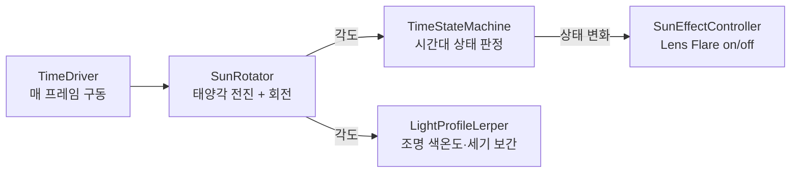

# TimeSystem

태양 각도 하나만 굴리면 하루가 흘러갑니다. 시간대(일출/낮/일몰/밤)도, 조명의 색온도·세기도, 태양 효과도 모두 이 각도 하나에서 나옵니다. 시간 정보를 한 곳에만 두어 서로 어긋나지 않게 했습니다.

<!-- 시간 흐름(낮 → 밤) gif -->

---

## 목차

- [실행 흐름](#실행-흐름)
- [시간 진행](#시간-진행) — 각도가 곧 빛의 방향, 낮/밤 비율
- [시간대 상태](#시간대-상태) — enter/exit 액션 패턴
- [조명 보간](#조명-보간) — 프로필 사이 보간 + 360° wrap (핵심)
- [태양 효과](#태양-효과) — Lens Flare
- [관련 코드](#관련-코드)

---

## 실행 흐름

`TimeDriver`가 매 프레임 태양 각도를 한 번 전진시키고, **그 각도 하나로** 상태 전환과 조명 보간을 모두 구동합니다. 시간 정보가 각도로 일원화되어 있어, 상태와 조명이 어긋날 일이 없습니다.



---

## 시간 진행

태양 회전은 `SunRotator`가 맡습니다. 매 프레임 각도를 전진시키고, 그 각도를 그대로 **디렉셔널 라이트의 회전에 적용**합니다. 태양 각도가 곧 빛이 비추는 방향이 되어, 각도가 돌면 해가 뜨고 지며 그림자도 함께 움직입니다.

낮과 밤의 진행 속도는 **따로 둘 수 있습니다.** 같은 한 바퀴라도 낮을 길게, 밤을 짧게 하는 식으로 **게임에 맞는 낮/밤 비율**을 맞추기 위함입니다.

```csharp
// 낮/밤 속도를 따로 적용해 각도를 전진시키고
float speed = IsDaytime() ? DaySpeed : NightSpeed;
currentAngle += speed * deltaTime;

// 그 각도를 디렉셔널 라이트 회전에 그대로 적용 → 각도가 곧 빛의 방향
directionalLight.transform.rotation = Quaternion.Euler(currentAngle, 20, 0);
```

---

## 시간대 상태

`TimeStateMachine`은 각도를 받아 시간대를 **Sunrise / Day / Sunset / Night** 로 판정합니다. 각 시간대는 시작 각도(`startAngle`)로 정의되고, 정렬된 다음 프로필의 시작 각도가 곧 현재 구간의 끝이 됩니다.

핵심은 상태가 **바뀌는 순간에만** 동작을 실행하는 **enter/exit 액션 패턴**입니다. 매 프레임 상태를 갱신하되, 직전과 달라졌을 때만 이전 상태의 종료 동작과 새 상태의 진입 동작을 호출합니다.

```csharp
public void UpdateState(float angle)
{
    TimeOfDayState newState = GetStateFromAngle(angle);
    if (newState != currentState)
    {
        InvokeExitActions(currentState);   // 이전 시간대 종료 동작
        currentState = newState;
        InvokeEnterActions(currentState);  // 새 시간대 진입 동작
    }
}
```

이 구조 덕분에 다른 시스템(예: 태양 효과)이 "밤이 시작되면 꺼져라" 같은 반응을 **상태머신에 등록**만 하면 됩니다. 시간대 변화에 반응하는 쪽과 시간을 굴리는 쪽이 분리됩니다.

---

## 조명 보간

시간대가 칸칸이 끊겨 바뀌면 조명도 툭툭 변합니다. 이를 막기 위해 각 시간대 프로필에 **색온도·세기**를 두고(`TimeOfDayProfile`), 현재 각도가 **인접한 두 프로필 사이 어디인지**를 비율 `t`로 구해 그 사이를 연속 보간합니다.

여기서 까다로운 점은 **각도가 360°에서 0°로 넘어가는 구간**입니다. 마지막 프로필(예: 밤)에서 첫 프로필(예: 일출)로 이어질 때는 구간이 360°를 가로지르므로, 일반적인 `a ≤ angle < b` 비교가 통하지 않습니다. 그래서 wrap을 따로 처리합니다.

```csharp
// 마지막→첫 프로필 구간은 360°를 가로지르므로 wrap 비교
bool inRange = current.startAngle < next.startAngle
    ? angle >= current.startAngle && angle < next.startAngle
    : angle >= current.startAngle || angle < next.startAngle;

// 구간 폭과 현재 위치도 wrap을 고려해 t를 구한 뒤 색온도·세기를 보간
float t = angleSpan > 0f ? angleOffset / angleSpan : 0f;
directionalLight.colorTemperature = Mathf.Lerp(from.colorTemperature, to.colorTemperature, t);
directionalLight.intensity        = Mathf.Lerp(from.intensity,        to.intensity,        t);
```

덕분에 일출→낮→일몰→밤→다시 일출로 한 바퀴 도는 내내 조명이 **연속적으로** 바뀝니다. 시간대 상태가 "어느 칸인지"를 말한다면, 이 보간은 "그 칸 안에서 얼마나 왔는지"를 빛으로 표현합니다.

---

## 태양 효과

`SunEffectController`는 태양의 **Lens Flare**를 시간대에 맞춰 켜고 끕니다(일출에 활성, 밤에 비활성). 위의 enter/exit 액션 패턴에 등록되어 있어, 상태머신이 시간대를 바꾸면 자동으로 반영됩니다 — 별도의 매 프레임 검사 없이 상태 전환 순간에만 동작합니다.

---

## 관련 코드

| 역할 | 클래스 |
|---|---|
| 시간 진행 루프 | `TimeDriver` |
| 태양 회전(각도→빛의 방향) · 낮밤 비율 | `SunRotator` |
| 시간대 상태 전환 · enter/exit 액션 | `TimeStateMachine` |
| 조명 프로필 보간(색온도/세기) | `LightProfileLerper` |
| 태양 Lens Flare | `SunEffectController` |
| 시간대 프로필(시작각/색온도/세기) | `TimeOfDayData` |
