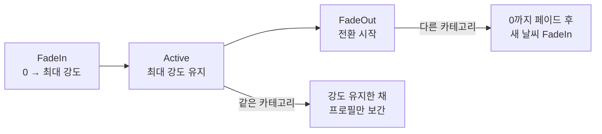

# Weather

날씨를 확률로 고르고, 눈·비·맑음 사이를 강도 곡선으로 전환합니다. 선택된 날씨에 맞춰 눈/비 이펙트와 구름이 바뀌며, 이펙트는 플레이어 주변에만 풀링되어 따라다닙니다.

이 폴더 아래에 적설([Snow](./Snow/README.md))과 젖음([Rain](./Rain/README.md)) 모듈이 있습니다.

---

## 목차

- [실행 흐름](#실행-흐름)
- [날씨 선택](#날씨-선택) — weight 기반 확률 + 카테고리
- [강도 페이즈 머신](#강도-페이즈-머신) — FadeIn / Active / FadeOut (핵심)
- [이펙트 풀링과 청크 배치](#이펙트-풀링과-청크-배치) — 카메라 방향 인지
- [구름](#구름) — Volumetric Clouds
- [관련 코드](#관련-코드)

---

## 실행 흐름

`WeatherStateMachine`이 날씨 하나의 수명을 관리합니다. 다음 날씨를 미리 **큐에 예약**해 두고, 현재 날씨가 끝나면 큐의 날씨로 넘어갑니다.


---

## 날씨 선택

다음 날씨는 후보들의 **weight(가중치) 기반 확률**로 고릅니다(`WeatherSelector`). 흔한 날씨에 큰 가중치를, 드문 날씨에 작은 가중치를 주는 식으로 등장 빈도를 조절합니다.

각 날씨는 **타입**(눈/비/맑음 등)과, 여러 타입을 묶는 상위 **카테고리**(`WeatherData`)를 가집니다. 카테고리는 다음 절의 전환 방식에서 핵심 역할을 합니다.

---

## 강도 페이즈 머신

날씨 강도는 세 단계를 거칩니다.



핵심은 **카테고리에 따라 전환을 다르게** 처리하는 점입니다.

- **같은 카테고리**로 바뀌면(예: 약한 눈 → 강한 눈) FadeOut을 거치지 않고, Active 안에서 **이전 강도에서 새 강도로 보간**합니다. 눈이 한 번도 멎지 않고 세기만 변합니다.
- **다른 카테고리**로 바뀌면(예: 눈 → 비) **0까지 페이드**해 이전 날씨를 완전히 거둔 뒤, 새 날씨를 FadeIn으로 올립니다.

```csharp
// FadeOut: 같은 카테고리면 강도 유지(프로필만 교체), 다른 카테고리면 0까지 페이드
currentIntensity = keepIntensity
    ? currentProfile.maxIntensity
    : Mathf.Lerp(currentProfile.maxIntensity, 0f, intensityT);
```

이렇게 나눈 이유는 **전환의 자연스러움** 때문입니다. 눈에서 눈으로 바뀌는데 한 번 그쳤다 다시 내리면 어색하지만, 눈에서 비로 바뀔 때는 눈이 완전히 멎고 비가 시작되는 게 맞습니다. 같은 비주얼 계열인지 아닌지를 카테고리로 구분해 전환 방식을 정합니다.

---

## 이펙트 풀링과 청크 배치

눈/비 파티클을 월드 전체에 깔면 낭비입니다. 그래서 플레이어 주변을 **청크 그리드**로 나누고, 각 청크에 이펙트를 **풀에서 빌려** 배치합니다. 플레이어가 이동하면 멀어진 청크의 이펙트를 회수해 가까워진 청크에 재사용하므로, 한정된 이펙트로 넓은 영역을 커버합니다.

배치는 **카메라 방향을 인지**합니다. 시야 정면 쪽은 멀리까지(`frontRadius`), 등 뒤는 가깝게(`backRadius`) 청크를 깔아, 실제로 보이는 쪽에 이펙트를 집중합니다. 항상 유지하는 코어 반경(`coreRadius`)은 플레이어 바로 주변을 빈틈없이 채웁니다.

```csharp
// 정면(frontRadius)과 후방(backRadius) 중 큰 쪽까지 순회하되,
// 코어 반경 안은 항상 채우고 바깥은 방향에 따라 취사선택
int maxRadius = Mathf.Max(frontRadius, backRadius);
for (int x = -maxRadius; x <= maxRadius; x++)
    for (int z = -maxRadius; z <= maxRadius; z++)
    {
        if (Mathf.Abs(x) <= coreRadius && Mathf.Abs(z) <= coreRadius)
            cachedChunkPositions[currentCenterChunk + new Vector2Int(x, z)] = new Vector2Int(x, z);
        // ... 코어 밖은 카메라 방향 기준으로 포함 여부 결정
    }
```

---

## 구름

`CloudController`가 **Volumetric Clouds** 프리셋을 날씨 상태에 맞춰 적용합니다. 맑음과 눈/비일 때 구름의 밀도·모양이 달라져, 하늘도 날씨에 함께 반응합니다.

---

## 관련 코드

| 역할 | 클래스 |
|---|---|
| 날씨 수명 · 강도 페이즈 · 풀링 · 청크 | `WeatherStateMachine` |
| weight 기반 날씨 선택 | `WeatherSelector` |
| 날씨 타입 · 카테고리 정의 | `WeatherData` |
| Volumetric Clouds 프리셋 | `CloudController` |
| 적설 모듈 | [Snow](./Snow/README.md) |
| 젖음 모듈 | [Rain](./Rain/README.md) |
