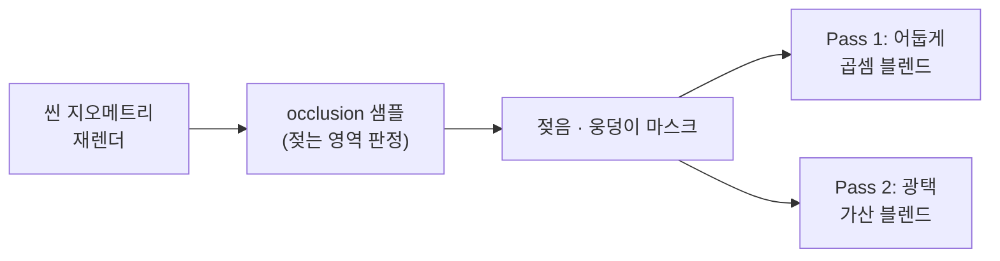

# Rain

비가 내릴 때 표면을 적십니다. 눈의 Sky Occlusion 데이터를 그대로 공유해, 실내나 천장 아래처럼 비를 못 맞는 곳은 젖지 않습니다. 젖은 바닥은 어두워지고 동시에 반들거리며, 패인 곳에는 웅덩이가 더 도드라집니다.

<!-- 비 젖음 gif -->

---

## 목차

- [젖음 렌더링 흐름](#젖음-렌더링-흐름)
- [2패스 젖은 표면](#2패스-젖은-표면) — 어둡게 + 광택 (핵심)
- [occlusion 공유와 이진화](#occlusion-공유와-이진화) — 실내는 마르게
- [비 파티클](#비-파티클) — 강도 · 거리 LOD
- [레거시: 데칼 방식](#레거시-데칼-방식)
- [관련 코드](#관련-코드)

---

## 젖음 렌더링 흐름

젖음은 씬 지오메트리를 **젖음 셰이더로 한 번 더 렌더**하는 방식입니다(`RainRendererFeature`). 이는 눈(`SnowRendererFeature`)과 **동일한 "지오메트리 재렌더" 구조**라, 두 시스템이 같은 패턴을 공유합니다.



---

## 2패스 젖은 표면

젖은 느낌은 한 패스로는 부족합니다. 젖은 바닥은 **빛을 덜 반사해 어두워지는 동시에**, 표면 물기 때문에 **하이라이트는 더 강해지기** 때문입니다. 이 상반된 두 효과를 블렌드 모드가 다른 두 패스로 나눠 처리합니다.

| 패스 | 블렌드 | 역할 |
|---|---|---|
| **WetDarken** | `Blend DstColor Zero` (곱셈) | 젖은 영역을 어둡게. 원본 색을 읽지 않고 화면 색에 곱해 가라앉힘 |
| **WetSpecular** | `Blend One One` (가산) | 물기로 인한 스페큘러 하이라이트를 더함 |

곱셈 블렌드는 화면에 이미 그려진 색(`DstColor`)에 젖음 색을 곱하는 방식이라, **원본 표면을 따로 샘플링하지 않고도** 젖은 영역만 자연스럽게 어둡게 만듭니다.

**웅덩이(puddle)** 는 한 단계 더 들어갑니다. 패인 곳일수록 마스크가 강해져 더 어둡고 더 반들거리며, 노멀을 위로 당겨 **수면처럼 평평하게** 만들어 거울 같은 반사를 냅니다.

```hlsl
// 젖음 + 웅덩이 마스크. 웅덩이일수록 강함
float amount = wetMask + puddleMask;
// 웅덩이는 수면처럼 평평 → 노멀을 위로 당겨 더 거울 같은 반사
normalWS = normalize(lerp(normalWS, float3(0, 1, 0), puddleMask));
```

---

## occlusion 공유와 이진화

비가 닿는지 여부는 **눈과 똑같은 Sky Occlusion 데이터**로 판단합니다(`SkyOcclusionCommon.hlsl`). 천장 아래에 눈이 안 쌓이는 것과 비에 안 젖는 것이 같은 데이터(노출도)로 처리됩니다.

다만 **눈과 다른 점**이 있습니다. 눈은 천장 경계에서 적설이 경사지게 줄어드는 taper가 자연스럽지만, **비는 그 경사가 필요 없습니다.** 처마 밑은 젖고 안 젖고가 또렷하게 갈리죠. 그래서 노출도를 임계값으로 **이진화**해, 젖는 영역이 천장 실제 크기에 딱 맞게 합니다.

```hlsl
float exposure = data.r;          // 1=노출(비 맞음), 0=천장 아래(마름)
// 비는 눈 같은 경사 taper가 불필요 → 임계값으로 이진화
// (taper 띠가 "덜 젖음"으로 넓게 번지는 것 방지)
return exposure > _WetOcclusionCutoff ? 1.0 : 0.0;
```

같은 occlusion을 쓰되 **소비 방식만 다르게**(눈은 경사, 비는 이진화) 해서, 한 데이터로 두 시스템의 서로 다른 요구를 만족시켰습니다.

---

## 비 파티클

내리는 비 자체는 파티클로 표현합니다(`RainController`). **emission rate로 강도**를 조절하고, **카메라 거리 LOD로 on/off**를 제어해 멀리 있는 비는 끄고 가까운 곳만 그립니다. `WeatherStateMachine`이 풀링하며 위치·강도를 갱신하므로, 젖은 표면(셰이더)과 내리는 비(파티클)가 같은 날씨 강도에 함께 반응합니다.

---

## 레거시(이전코드): 데칼 방식

이전에는 젖은 바닥을 **DecalProjector 데칼**로 표현했습니다(`WetPlaneController` — 페이드 인/아웃 + 그리드 기반 물웅덩이). 현재는 지형 `WetSurface.shader`가 occlusion 노출도로 젖음을 직접 렌더하므로 이 데칼 컨트롤러는 불필요하며, 비교를 위해 코드에만 남겨두었습니다.

---

## 관련 코드

| 역할 | 클래스 / 셰이더 |
|---|---|
| 젖음 지오메트리 재렌더 패스 | `RainRendererFeature` |
| 젖은 표면 셰이딩(2패스) | `WetSurface.shader` |
| occlusion 공통 계산(눈·비 공유) | `SkyOcclusionCommon.hlsl` |
| 비 파티클(강도 · 거리 LOD) | `RainController` |
| (레거시) 데칼 방식 젖음 | `WetPlaneController` |
