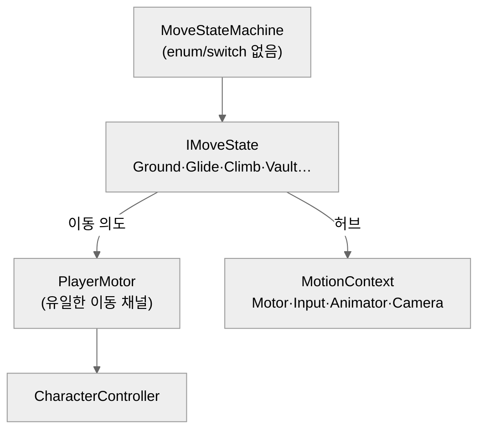

# 캐릭터 이동 — Rigidbody FSM에서 CharacterController로 재설계

> **[◂ Terra Vela](../README.md)** 의 캐릭터 이동·파쿠르 시스템
>   

오래된 Rigidbody 상태머신을 CharacterController 기반으로 다시 지은 이동 시스템. 걷기·달리기·점프부터 활공·클라이밍·벽점프, 그리고 파쿠르 6종까지를 **하나의 이동 채널**과 **enum 없는 상태머신** 위에 얹었다. 가장 큰 변경점중 하나는 파쿠르를 — 전방을 레이캐스트로 재어 종류를 판별하고, 전진 루트모션이 없는 애니를 **위치 워핑 + 손 IK**로 실제 지형에 맞춘다.


 
### 이 시스템이 보여주는 것
- **재설계 판단** — 상태마다 물리를 제각기 조작하던 구조를, 이동을 단 하나의 채널로 모으고 상태는 "의도"만 내게 분리.
- **확장에 강한 상태머신** — enum·switch 없이 상태 객체가 다음을 지시. 파쿠르 6종을 얹을 때 디스패치 코드를 한 줄도 안 건드렸다.
- **문제에 맞춘 파쿠르** — 애니에 전진 루트모션이 없다는 제약에서 출발해 위치 워핑을 택했고, 감지는 `mesh.vertices` 대신 레이캐스트로.

---

## 한눈에

**상태는 의도를 생산하고, 이동은 한 곳에서만 일어난다.**

각 상태(걷기·매달리기·활공·볼트…)는 자기 로직을 돌려 "이번 프레임 이렇게 움직여라"를 모터에 넘기고, `PlayerMotor` 하나가 CharacterController로 실제 이동 + 섬 캐리 합산 + 중력을 단일 관리한다. 상태 전환은 상태 객체가 직접 지시하고(enum 디스패치 없음), 협력 객체는 컨텍스트 허브로 주입해 상태 간 결합을 끊었다.



---

## 왜 Rigidbody를 버렸나 — 단일 이동 채널

**구 구조는 상태마다 Rigidbody를 제각기 조작했다** — velocity·AddForce·MovePosition이 뒤섞여, 움직이는 섬 위 캐리·중력·충돌이 상태마다 어긋났다. 특히 dynamic Rigidbody는 움직이는 플랫폼 위에서 잔떨림을 근본적으로 못 잡았다(→ 섬 조종 시스템에서 다룬 전환).

재설계의 축은 **모든 이동을 `PlayerMotor.Move` 하나로 통과**시킨 것이다. 섬 캐리·중력·수직속도·접지가 한 곳에서만 결정되고, 상태는 "어디로 얼마나"만 낸다. 상태별로 흩어졌던 캐리 공백이 이 단일화로 사라진다.

**상태머신엔 enum·switch가 없다.** 구 FSM은 `switch(state)` 디스패치라 상태가 늘 때마다 분기가 커졌다. 새 머신은 상태 객체가 다음 상태를 직접 지시한다. 상태 추가 = 클래스 하나 + 조립부에서 생성·주입, 디스패치 코드는 안 건드린다 — 파쿠르 6종을 얹으며 이 이점이 실증됐다.

```csharp
// 이동 상태 전환기. enum·switch 없이 상태 객체만 바꾼다 — 상태 추가 시 이 클래스는 안 건드린다.
public void Change(IMoveState next)
{
    if (next == current) return;
    current?.Exit();
    current = next;
    current?.Enter();
}
```
<sub>* `MoveStateMachine`에서 발췌</sub>

---

## 파쿠르 — 감지 · 위치 워핑 · 손 IK

**F 홀드 + 앞의 지형에 반응해 6종이 자동 발동한다** — 볼트, 낮은 뛰어넘기, 낮은 턱 오르기, 달려 오르기, 월런(벽 달리기 진입), 틈 건너뛰기. 하나의 파쿠르 액션은 **감지 · 워핑 · IK** 세 축으로 이뤄진다.

**감지는 한 곳에서, 레이캐스트로.** `ParkourSystem`이 전방을 재어 윗면 3점(앞·중간·뒤 모서리)과 착지점을 산출하고, 높이·두께로 종류를 정한다. 구 프로젝트가 쓰던 `mesh.vertices` 직접 읽기(호출마다 전체 정점 복사·GC, 편집되는 섬 메시에 취약)를 전부 레이캐스트로 대체했다 — 앞면은 촘촘한 높이 훑기(얇은 공중 플레이트도 안 놓침), 뒷 모서리는 윗면을 따라 marching해 실제 깊이를 잰다(ㄱ자·스택 대응).

**위치 워핑 — 애니에 전진 루트모션이 없어서.** 파쿠르 애니는 상하·회전 루트모션은 있어도 전진(XZ)이 포즈에 구워져 순수 루트모션 워핑이 불가하다. 그래서 애니는 비주얼로 재생하되 코드가 **감지된 시작→착지 지점으로 위치를 워프**한다(XZ 보간 + Y 아크/단계). 감지된 실제 지점에 정확히 맞고, 애니 속도를 바꿔도 normalizedTime 기반이라 궤적이 동기화된다.

**손 IK는 릴레이로.** `OnAnimatorIK`는 Animator 오브젝트에서만 불리므로, 릴레이가 그 오브젝트에 붙어 상태의 지시(어느 손·어디·어떤 각도)를 IK로 적용하고 가중치를 부드럽게 블렌드한다. 짚는 위치·타이밍은 애니 프레임 기준으로 맞춘다.

| 동작 | 조건 | 궤적 | 손 IK |
|---|---|---|---|
| 낮은 뛰어넘기 | 아주 낮음 | Sin 아크 | 없음 |
| 볼트 | 허리·얇음·넘을 공간 | Sin 아크 + 윗면 훑기 | 한 손 |
| 낮은 턱 오르기 | 허리·두꺼움/막힘 | Y 단계 + XZ 동시 | 한 손 |
| 달려 오르기 | 중간 높이 | 2단 애니(잡고 끌어올림) | 양손 |
| 월런 | 너무 높음 + 달리기 | 클라이밍 진입(스프린트) | — |
| 틈 건너뛰기 | 벽 없음 + 건너편 땅 | 거리 비례 아크 | 없음 |

같은 "앞의 벽"이라도 높이·두께·달리기 여부로 갈린다. 판별을 한 조건 트리로 모아 종류 경계를 한눈에 두었고, 착지 지점은 감지된 실제 윗면/땅을 검증해 ㄱ자·틈에서 벽 관통·헛착지를 막는다.

---

## 결합을 끊는 컨텍스트 · 애니 주도 동작

**상태끼리 서로를 직접 참조하면 그물이 된다.** Motor·Input·Animator·Machine·Camera를 `MotionContext` 허브에 모아 주입 → 상태는 컨텍스트로만 협력한다.

**애니 주도 동작은 코루틴 대신 Tick 기반.** 클라이밍 종료·파쿠르처럼 "애니 재생 + 그동안 위치 이동"은 코루틴이 흔하나 상태머신과 섞이면 흐름이 꼬인다. `ScriptedMoveState`가 진입 시 CharacterController를 끄고, Tick에서 애니 진행도에 맞춰 위치를 워프한다 — 상태머신 한 박자로 통일. 루트모션 회전도 같은 이유로 릴레이가 Model에서 받아 루트에 전달한다(위치는 CC, 회전만 애니).

**착지 판정엔 코요테 + 벽점프 유예.** 접지가 벽 스침·순간 공중에 오염돼 낙하↔착지가 깜빡였다. 연속 접지 시간 + 상승 중 접지 무시 + 벽점프 직후 유예로 헛접지를 걸렀고, 작은 턱·계단에선 코요테(짧은 공중은 착지 유지)로 착지모션·턱 멈춤을 없앴다.

---

## 범위 밖

파쿠르 외 일반 상호작용(아이템·문) 팝업 UI, 클라이밍 고급(코너·플립), 갈고리는 뺐다 — 파쿠르를 첫 상호작용 대상으로 편입할 자리(F 탭 vs 홀드)를 남겼다. 조준(전투) 이동은 전투 재설계와 함께.

## 기술 스택

Unity 6 · URP · C# · CharacterController · Unity Input System · ScriptableObject 튜닝 · 애니메이터 IK·루트모션

> 튜닝값을 도메인별 ScriptableObject로 뺀 건 상태가 늘며 인스펙터가 폭발했기 때문 — 값 관리를 에셋으로 옮겨 캐릭터별 세팅 재사용의 기반을 만들었다.
