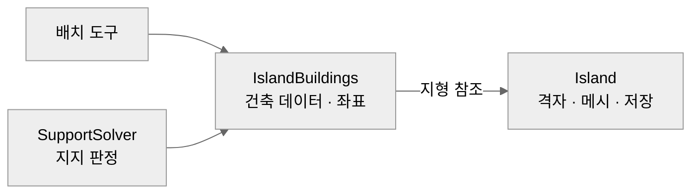
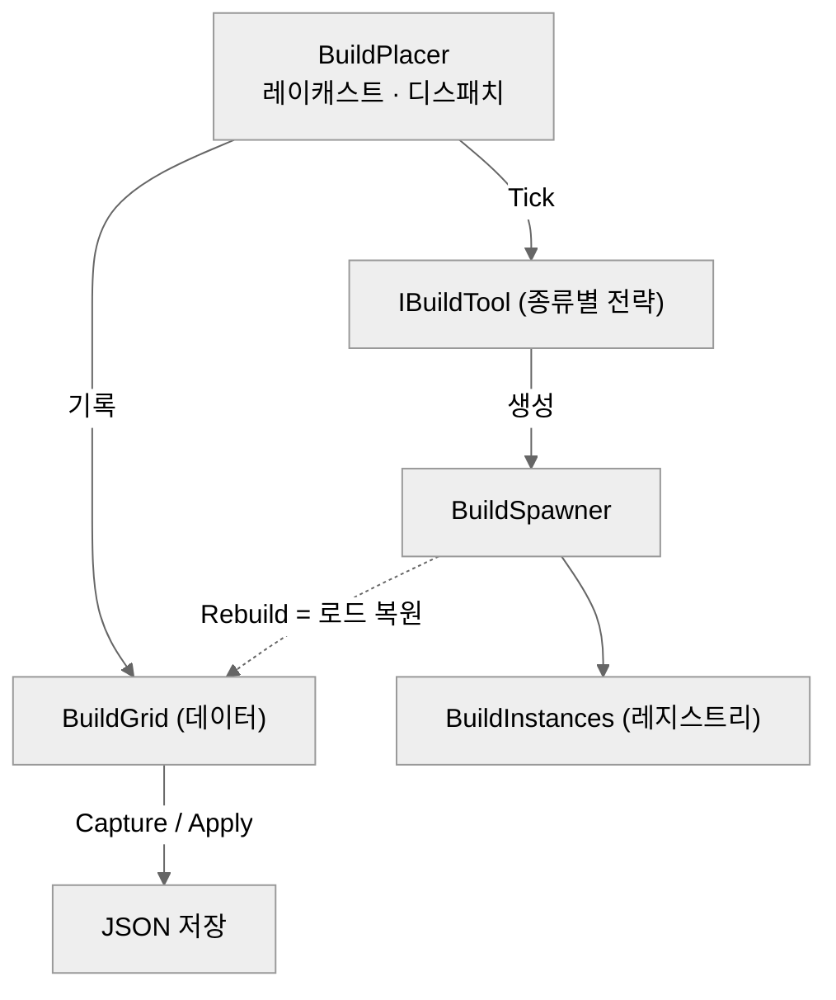

# 하늘섬 지형 · 건축 시스템

> **[◂ Terra Vela](../README.md)** 의 지형·건축 시스템
>   

실시간으로 조각하는 떠다니는 섬 위에 모듈러 건축을 짓는 시스템. 섬을 브러시로 조각하고(마칭 스퀘어), 그 위에 토대·벽·계단·바닥판을 지으며, 배치물이 서로 지지하고 지지가 끊기면 연쇄 파괴된다.


<!-- 대표 장면: 브러시로 섬 조각 → 토대·벽·바닥판 배치까지 한 흐름 (10~15초 루프) -->

### 이 시스템이 보여주는 것
- **경계 설계** — 지형과 건축을 어디서 나누고 의존을 어느 방향으로 둘지. 순환 의존을 인지하고 단방향으로 분리했다.
- **문제에 맞춘 알고리즘** — 지지·연쇄파괴를 "토대에서의 도달 가능성(reachability)"으로 풀었다.
- **점진적·검증적 리팩터** — 배치를 담당하던 700줄짜리 클래스를 동작 보존하며 약 140줄 껍데기 + 6개 전략으로 분해했다.
- **데이터 주도 설계와 그 한계** — 배치물을 ScriptableObject로 빼되, 무엇을 데이터로 두고 무엇을 코드로 둘지 선을 그었다.

---

## 한눈에

**떠다니는 섬은 두 개의 독립된 축이다.**

- **지형(Island)** — 높이·채움 격자를 마칭 스퀘어로 메시화. 6종 브러시로 실시간 조각, 스트로크 단위 undo, JSON 저장.
- **건축(Build)** — 섬 위에 토대·벽·계단·바닥판을 격자 스냅으로 배치. 서로 지지하고, 지지가 끊기면 연쇄 파괴된다.

두 축이 어디서 나뉘고 의존이 어느 방향으로 흐르는지가 구조를 결정했다. 건축은 지형 위에 서지만, **지형은 건축을 모른다.**



의존은 **건축 → 지형** 한 방향으로만 흐른다.

---

## 지형 — 격자가 진실, 메시는 파생

편집은 격자(`heights`·`coverage`)만 바꾼다. 메시는 격자에서 매번 재생성되고, 저장도 메시가 아니라 격자만 직렬화한다. 세이브가 가볍고 메시 포맷 변경에 묶이지 않는다.

**왜 마칭 스퀘어인가.** 지형 표현에는 세 갈래가 있었다.

| 방식 | 경계 | 충돌 생성 | 세이브 | 비용 |
|---|---|---|---|---|
| 격자 블록 직접 메시화 | 계단형(각짐) | 공짜(칸=경계) | 가벼움 | 낮음 |
| 연속 복셀 + 마칭 큐브 (발헤임식) | 매끄러움(3D) | 팔 때마다 재계산 | 밀도 필드(무거움) | 높음 |
| **마칭 스퀘어 (2D coverage)** | 매끄러움(반칸) | 가벼움 | 2D 격자(가벼움) | 중간 |

이 프로젝트의 전제 — **1인 개발 · 로컬 JSON 세이브 · "섬 모양 → 조종 충돌" 이 핵심** — 에서는 연속 복셀의 비용이 정면으로 부딪힌다. 땅을 팔 때마다 메시·콜라이더를 재생성하고 밀도 필드를 통째로 저장·동기화해야 하기 때문이다. 반대로 격자 블록은 싸지만 섬이 각지게 나온다. **마칭 스퀘어**는 2D 채움값(`coverage` 0..1)을 등고선화해 반칸 단위의 부드러운 경계를 얻으면서, 2D 격자의 단순함과 가벼운 세이브를 그대로 유지한다 — 매끄러움의 대부분을 격자 수준 비용에 얻는 중간 지점이다.

**편집 중에 그 위를 걷기.** 새 메시를 만들며 옛 메시를 파기하면 `MeshCollider`가 붙잡던 메시가 사라져 캐릭터가 밑으로 빠진다. 그래서 시각 메시와 충돌 메시의 수명을 분리했다 — 파기할 때 콜라이더가 붙잡은 메시는 건드리지 않는다. 재생성 스로틀(0.1초)로 빈도를 낮춰 프레임과 타협.


<!-- GIF 자리: Raise/Lower/Place/Flatten/Ramp로 조각 + 매끄러운 경계 강조 -->


---

## 건축 — 데이터와 오브젝트의 분리

**데이터 / 오브젝트.** `BuildGrid`는 "무엇이 어디에"(직렬화), `BuildInstances`는 씬의 실물(레지스트리). 미리보기(고스트)와 실물이 같은 컴포넌트를 갖기에, 레지스트리로 실물만 구분해 지지·철거가 고스트를 건드리지 않게 했다.

**생성 단일 경로.** 배치와 저장 복원이 모두 `BuildSpawner`를 통한다. `Rebuild`가 격자를 읽어 씬을 세우므로, 로드가 배치와 같은 코드를 탄다.




<!-- GIF 자리: 토대 → 벽(스택·반벽) → 바닥판(다층) → 계단 배치, 염색 드래그까지 -->

---

## 지지 판정 — 토대에서의 도달 가능성

**토대·벽·바닥판·계단은 서로를 받친다. 무엇이 무너지고 무엇이 남는가?** 이 판정을 **연결성 그래프의 reachability**로 풀었다 — 섬이 "중앙과 연결된 땅만 남기듯", 건축은 "지지된 토대에서 지지 간선을 따라 도달 가능한 것만 남긴다".

핵심은 **시드가 오직 토대**라는 점이다. 벽↔벽, 벽↔바닥판, 바닥판↔바닥판 간선은 지지를 전파만 하고 만들지 않는다.

```csharp
// 시드는 오직 토대에 직접 닿은 것. (전파 간선은 지지를 옮기기만 하고 만들지 않는다)
foreach (Wall w in walls)
    if (IsFoundationSupported(island, w) && !EdgeSitsOnRemovedFoundation(w.Edge, removedCells))
        supportedWalls.Add(w);              // → 큐에

// 벽·바닥판을 함께 고정점까지 넓힌다. 토대 뿌리 없는 순환 덩어리는 도달되지 않아 남지 못한다.
while (wallQueue.Count > 0 || floorQueue.Count > 0)
{
    // 벽  → 벽(스택·수평) · 벽  → 바닥판(얹힘)
    // 바닥판 → 바닥판(이웃) · 바닥판 → 벽(매달림)
}
// 도달 안 된 것 = 지지 상실 → 연쇄 파괴 대상
```
<sub>* 실제 `SupportSolver`에서 발췌 · 전파 판정부는 생략</sub>


이게 필요한 이유: 벽과 바닥판은 서로 받칠 수 있어(바닥판이 벽 위에 얹히거나, 벽이 바닥판 아래 매달리거나) 그래프에 **순환**이 생긴다. "내 옆에 받쳐주는 게 있나"만 국소로 보면 벽 스택과 그 위 바닥판이 서로를 가리키며 살아남는다 — 밑 토대가 사라져도. 그래서 벽·바닥판을 함께 고정점까지 넓히되 시드를 토대로 한정했다. 토대 뿌리 없는 순환 덩어리는 도달되지 않아 함께 무너진다.

이 판정 하나를 **직접 철거와 지형 편집(공중 판정)이 공유**한다 — 지지의 진실이 코드 한 곳에서만 나온다.


<!-- GIF 자리(핵심): 토대/벽을 제거 → 지지 잃는 것들이 빨갛게 강조되고 확인창 → 연쇄 파괴. 다리로 이어진 구조는 반대쪽이 살아남는 것도 보이면 최고 -->


<details>
<summary>설계가 처음부터 옳지는 않았다 — 실패에서 배운 것</summary>

<br>

초기엔 "내 옆에 받쳐주는 게 있나"를 보는 국소 한 홉 근사로 시작했다. 이게 위의 순환 지지 버그를 만들었고 — 벽 스택과 그 위 바닥판이 서로를 가리키며 살아남았다 — 그 실패가 "토대뿌리 reachability여야 한다"는 결론으로 이끌었다. 순수 로직 시뮬레이션으로 다리 시나리오를 재현해 교체를 검증했다.

</details>

---

## 배치는 전략, 배치물은 데이터

**프로토타입에서 배치 로직 한 클래스가 700줄까지 자랐다.** 종류마다 조준·미리보기·배치가 다르므로 각 배치물을 **`IBuildTool` 구현체**(전략 패턴)로 떼고, 조율자는 레이캐스트 후 현재 종류의 도구에 위임만 하게 했다(약 140줄로).

```csharp
// 배치물 한 종류의 배치·미리보기·철거 전략. BuildPlacer는 레이캐스트만 하고 도구에 프레임을 넘긴다.
public interface IBuildTool
{
    void Tick(IslandBuildings island, RaycastHit hit, Vector3 localHit); // 미리보기 + 좌클릭 배치 / 우클릭 철거
    void OnScroll(float scroll, bool alt);                               // 휠: 높이·꺾기·회전 등 종류별 조절
}
// 배치물이 늘어도 도구 하나를 추가할 뿐, 조율자는 그대로.
```
<sub>* `IBuildTool` 인터페이스 전문</sub>


배치물의 *정의*(프리팹·종류·이름)는 코드가 아니라 **`BuildPiece` 에셋**이다. `BuildCatalog`가 이를 모으고 배치기·스포너가 공유한다. 프리팹과 enum을 코드에 박았다면 변형마다 코드 수정·재빌드가 필요하지만, 데이터로 빼면 새 *변형*(다른 룩의 벽·바닥판)은 에셋 하나로 붙는다. 네 배치물의 공통 뼈대(하이라이트·염색·파괴)는 `Buildable` 베이스로 올렸다.

**데이터화의 선 — 변형은 데이터, 새 종류는 코드.** 완전히 새로운 종류(예: 경사로)는 배치가 인터랙티브 기하라 도구가 필요하다. 지지 규칙도 격자·타입 특화 기하라 억지 데이터화는 과설계가 된다. 카탈로그까지가 실익이라 판단하고 멈췄다.

```csharp
// 4종 공통 뼈대(Template Method). 파생은 좌표·데이터와 "격자에서 나를 지우는 법"만 채운다.
public abstract class Buildable : MonoBehaviour, IDestructibleOnAirborne, IColorable
{
    public void DestroySelf()
    {
        IslandBuildings island = GetComponentInParent<IslandBuildings>();
        if (island != null) RemoveFromGrid(island);
        Destroy(gameObject);
    }
    protected abstract void RemoveFromGrid(IslandBuildings island); // 종류별: 격자 항목·등록 해제
}
```
<sub>* `Buildable` 베이스에서 발췌 · 염색/하이라이트 멤버 생략</sub>

적용 패턴: **Strategy**(도구) · **Template Method**(`Buildable`) · **Data-Driven ScriptableObject Registry**(카탈로그).

---

## 경계 분리 — 순환 의존 끊기

**프로토타입에서 `Island`은 지형과 건축을 둘 다 들고 있었다**(건축 데이터·좌표·저장까지). 그 결과 지형이 건축을, 건축이 지형을 참조하는 **순환 의존**이 생겼다.

건축 소유를 새 컴포넌트 `IslandBuildings`로 옮기고 — 같은 GameObject에 붙어 지형은 참조로만 본다 — `Island`은 지형만 남겨 건축 타입을 하나도 가리키지 않게 했다. 의존이 한 방향으로 흐르면 나중에 건축을 별도 어셈블리로 떼거나 격리 테스트하기 쉬워진다. 세이브 파일만은 섬 전체를 함께 기술하는 경계 객체로 남겼다.

---

## 범위 밖

프로토타입 단계라 의도적으로 뺀 것: 멀티플레이어 동기화, 섬 조종(이동), 자재/인벤토리, 밭·장식품. 세이브·생성 경로는 확장 가능하게 두되 실제 연결은 하지 않았다.

## 기술 스택

Unity 6 · URP · C# · 마칭 스퀘어 지형 · ScriptableObject 데이터 · 로컬 JSON 세이브

> 세이브를 중앙 DB·클라우드 대신 **로컬 JSON**으로 둔 건 발헤임식 로컬 저장 전제 — 1인 프로토타입에 서버 인프라 없이 가장 단순하고, 위 마칭 스퀘어 선택의 "가벼운 세이브"도 이 전제에서 나온다.
