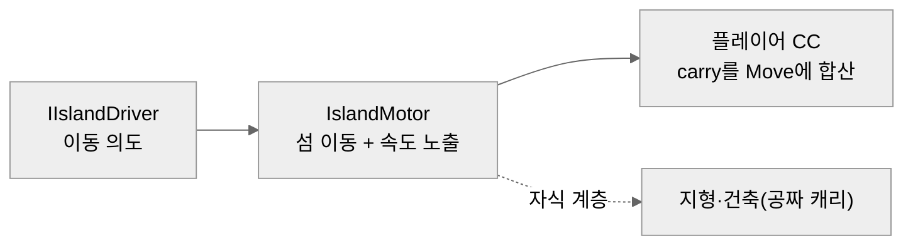

# 하늘섬 조종 — 상대이동 기반 (part 1)

> **[◂ Terra Vela](../README.md)** 의 탈것·이동 시스템
>   

섬을 움직이면 그 위의 플레이어와 건축물이 **함께 실려 가는** 탈것 플랫폼 기반. 내가 만든 땅이 곧 탈것이 되는 게임의 근간이라, "움직이는 발판 위의 캐릭터"를 어떻게 떨림 없이 실어 나르느냐가 이 시스템의 전부다. 그 답을 찾는 과정에서 플레이어의 물리 이동체를 **Rigidbody에서 CharacterController로 바꾸는** 판단이 나왔다.


 
### 이 시스템이 보여주는 것
- **물리 성질로 나눈 두 경로** — 정적 콘텐츠(건축)는 계층 캐리, 자체 이동체(플레이어)는 속도 캐리. 하나로 묶지 않은 이유가 설계의 핵심.
- **실패에서 나온 이동체 전환** — dynamic Rigidbody의 이동 플랫폼 잔떨림을 물리 설정으로 못 잡아, CharacterController로 근본 전환.
- **단방향 의존 · 확장점** — 조종 입력을 인터페이스로 추상화(`IIslandDriver`)해, 지금은 디버그 드라이버가, 이후 helm이 같은 자리에 꽂힌다.

---

## 한눈에

**섬은 "의도 → 적용 → 캐리 조회"의 세 층이다.**

드라이버가 이동 의도를 내고(m/s·°/s), 모터가 섬 루트를 실제로 옮기며, 플레이어는 매 프레임 모터에서 자기 캐리 속도를 조회해 자기 이동에 더한다. 의존은 **라이더 → 모터** 한 방향으로만 흐른다 — 모터는 자기를 타는 대상을 모른다.



---

## 플레이어와 건축물은 다른 메커니즘으로 옮긴다

**"둘을 같이 옮긴다"가 자연스러워 보이지만, 물리 성질이 정반대다.** 건축물은 스스로 안 움직이는 정적 콘텐츠라 **섬 루트의 자식**으로 두면 계층으로 공짜·정확히 따라간다. 매 프레임 델타를 더하는 방식은 float 드리프트만 쌓이고 낭비다. 반면 플레이어는 자체 이동체라 kinematic 플랫폼 위에 얹혀도 Unity가 자동으로 안 실어 나른다(특히 회전 시) — 그래서 플레이어만 "이번 프레임에 섬이 나를 얼마나 옮기나"를 계산해 더한다.

**회전 캐리는 궤도와 병진을 한 공식으로.** 섬이 돌면 플레이어는 제자리가 아니라 피벗 중심 궤도로 돌아야 딴 데로 안 튄다. 캐리 속도는 선속도에 수직축 회전의 접선속도를 더해 낸다.

```csharp
// worldPoint가 섬에 강체로 붙어 있을 때의 월드 속도. 선속도 + 수직축 회전의 접선속도.
public Vector3 GetRiderVelocity(Vector3 worldPoint)
{
    Vector3 angular = Vector3.up * yawSpeedRad;
    return linearVelocity + Vector3.Cross(angular, worldPoint - transform.position);
}
```
<sub>* `IslandMotor`에서 발췌</sub>

---

## dynamic Rigidbody → CharacterController — 실패에서 나온 전환

**이 시스템에서 플레이어 이동체를 바꾸는 판단이 나왔다.** 처음엔 플레이어가 dynamic Rigidbody였고 캐리를 위치에 얹었는데, **움직이는 섬 위에서 잔떨림**이 계속 남았다 — Interpolate·Discrete 등 설정을 바꿔도 안 잡혔다.

원인은 dynamic Rigidbody가 움직이는 비-convex MeshCollider 위에 얹히면 물리 솔버가 매 스텝 접촉을 재해결하며 미세 보정을 넣고, 여기에 캐리 오프셋이 겹쳐 **한 스텝에 두 번 움직이는 진동**이 생기는 것이다. "움직이는 플랫폼 위 dynamic Rigidbody"의 근본 한계다.

해결은 플레이어를 **CharacterController로 전환**하고 캐리를 위치 델타 대신 **속도**로 바꾼 것(`속도 × deltaTime`으로 Move에 합산). CC는 솔버에 밀리는 dynamic body가 아니라 직접 옮기는 방식이라 이중 이동이 없다. 이 전환이 곧 "플레이어 이동을 CC 하나로 단일화"하는 결정이 됐고, 그 위에서 이뤄진 이동 시스템 전면 재설계는 **[캐릭터 이동](../CharacterMovement/README.md)** 문서에서 다룬다.

---

## 단방향 의존 · pull · 확장점

**모터는 자기를 타는 대상을 모른다.** 모터가 라이더 목록을 들고 push하는 대신, 타는 쪽이 `GetRiderVelocity`로 자기 캐리를 조회(pull)한다. 의존이 한 방향으로만 흘러 라이더가 몇이든 모터는 무관하다. 실행 순서도 `[DefaultExecutionOrder]`로 못박아(모터 먼저 → 라이더 나중), 캐리 조회 시 모터가 이번 스텝 값을 이미 캐시하도록 보장한다.

조종 입력은 `IIslandDriver` 인터페이스로 추상화했다. 지금은 키보드로 섬을 움직이는 디버그 드라이버가 캐리를 검증하고, 실제 helm(방향·고도·회전)은 같은 자리에 교체로 꽂힌다.

---

## 알려진 개선점 (part2 선결)

GIF 촬영 중 드러난, 캐리의 두 빈틈. 원인은 파악됐고 part2(또는 캐리 보완)에서 처리한다.

- **섬 상하 이동 시 낙하 애니** — 섬이 아래로 내려가면 캐릭터가 순간 공중이 되고(`isGrounded=false`), 위로 올라가면 발밑에서 밀어올려지는 타이밍이 한 프레임 어긋나 접지가 깜빡여 낙하 상태로 빠진다. → **해결 방향**: 섬에 실려 있을 때(캐리 중)는 캐리의 수직 성분을 접지 판정에 반영하거나, 캐리 상태에서 낙하 진입을 억제.
- **섬 회전 시 플레이어가 안 돎** — `GetRiderVelocity`는 **위치**만 궤도로 옮기고 플레이어의 facing(회전)은 그대로라, 섬이 돌아도 캐릭터가 같은 방향을 봐 어색하다. → **해결 방향**: 캐리에 섬의 스텝 회전(yaw, `IslandMotor.StepRotation`)을 플레이어 회전에도 합성.

---

## 범위 밖

part1은 **섬 이동 + 라이더 캐리**까지다. 실제 조종 입력(helm), 충돌·급제동, 권장 고도, 자동 이동, 관성, 멀티 동기화는 part2로 뺐다 — 모터가 이동·속도의 단일 진실원이라 그 위에 얹기 좋은 자리를 남겼다.

## 기술 스택

Unity 6 · URP · C# · kinematic Rigidbody(섬) · CharacterController(플레이어) · 인터페이스 기반 드라이버

> 섬을 kinematic Rigidbody로 둔 건 물리力에 안 휘둘리되 MeshCollider가 스윕돼 충돌 판정에 걸리게 하기 위해서다.
